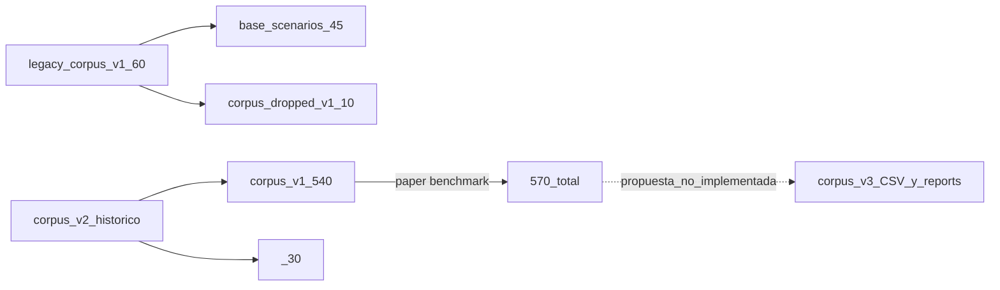

# Inventario maestro de `scenarios/`

**Generado:** 2026-05-24  
**Actualizado desde:** 2026-05-23 (conteos verificados post-reorganización y wiki round2)  
**Propósito:** mapa de partida para organizar, limpiar y mantener el subproyecto *the-one-scenario-corpus*.  
**Alcance:** todo lo bajo `scenarios/` excepto `.git/`, `.venv/`, `__pycache__/` y entornos locales.

> **Nota 2026-05-27 (canónico):** benchmark activo = `base_scenarios/` (45) + `corpus_v1/` (540) + `` (30) = **540** simulaciones con TP. **Validación de diversidad (paper):** solo **540** (`corpus_v1`, ``); métricas en `analysis/reports/RESULTADOS_ACTUALES.md`. Las secciones que citan **720** o matrices 720×720 son **histórico** (pre-reorg); no usar como resultados finales.

Para refrescar conteos:

```bash
cd scenarios
find . -type f ! -path './.git/*' ! -path './analysis/.venv/*' ! -path '*/__pycache__/*' ! -path './.wiki-clone/.git/*' | wc -l
find corpus_v1 -name '*.settings' | wc -l
find analysis/figures/spatial_heatmaps -name '*.png' | wc -l
wc -l corpus_v1/manifest.csv analysis/data/spatial_occupancy_metrics.csv analysis/data/output_metrics.csv
```

---

## 1. Visión general

El directorio `scenarios/` es un **subproyecto autónomo** (repo Git anidado) para:

1. **Corpus de simulación** — ficheros `.settings` de [The ONE](https://akeranen.github.io/the-one/) (DTN/OppNets).
2. **Pipeline de análisis** — extracción de features, correlaciones, figuras, dashboard Streamlit.
3. **Documentación pública** — wiki (`.wiki-clone/`), READMEs, informes de resultados.

### Corpus activo

| Corpus | Escenarios | Rol |
|--------|------------|-----|
| **`base_scenarios/`** | **45** | Bases estructurales sin TP (familias 01–06) |
| **`corpus_v1/`** | **540** | Benchmark ambiental con Traffic Profiles |
| **``** | **30** | Laboratorio stress/control (familia 07, TP01+TP10) |
| **Paper (`--corpus corpus_v1`)** | **540** | Manifest combinado en `analysis/data/corpus_v1_combined_manifest.csv` |
| `_archive/legacy_corpus_v1_pre_rename/` | 60 | HISTÓRICO — corpus movilidad pre-rename |
| `_archive/corpus_dropped_v1/` | 10 | HISTÓRICO — escenarios v1 retirados |

### Entradas y salidas externas

| Ruta | Rol |
|------|-----|
| `../../reports/` (raíz del repo ONE) | Reportes de simulación (`*MessageStatsReport.txt`, `*_spatial_occupancy_grid.csv`, etc.) |
| `../../one.sh` | Lanzador de simulaciones batch |
| `../../venv/` | Entorno Python del proyecto (numpy, pandas, streamlit…) |

### Etiquetas usadas en este documento

| Etiqueta | Significado |
|----------|-------------|
| **FUENTE** | Editado a mano; mantener en el repo |
| **GENERADO** | Salida de un script; regenerable |
| **HISTÓRICO** | Trazabilidad útil; no canónico |
| **OBSOLETO** | Candidato a archivar o eliminar |
| **DUPLICADO** | Copia redundante de otro artefacto |

### Documentación canónica (no duplicar aquí)

- Entrada del proyecto: [README.md](README.md), [README.es.md](README.es.md)
- Pipeline oficial (12 pasos): [analysis/SCRIPTS_INDEX.md](analysis/SCRIPTS_INDEX.md)
- Resultados congelados: [analysis/reports/RESULTADOS_ACTUALES.md](analysis/reports/RESULTADOS_ACTUALES.md)
- Catálogo de figuras: [analysis/figures/README.md](analysis/figures/README.md)
- Metodología features: [analysis/docs/features_core_vs_extended.md](analysis/docs/features_core_vs_extended.md)
- Wiki paper rebuild: [analysis/reports/wiki_meta/wiki_paper_rebuild_report.md](analysis/reports/wiki_meta/wiki_paper_rebuild_report.md)

---

## 2. Árbol de directorios (top-level)

**Total tracked:** variable (recalcular con los comandos de la cabecera).

| Ruta | Ficheros | Extensiones principales | Rol |
|------|---------:|-------------------------|-----|
| [base_scenarios/](base_scenarios/) | 47 | 45 `.settings`, `manifest.csv`, `README.md` | Corpus estructural sin TP (familias 01–06) |
| [corpus_v1/](corpus_v1/) | 543 | 540 `.settings`, 2 `.csv`, 1 `.md` | **Corpus ambiental activo** (TP) |
| []() | 32 | 30 `.settings`, `manifest.csv`, `manifest_revision.csv` | Stress/control separado (familia 07) |
| [_archive/corpus_dropped_v1/](_archive/corpus_dropped_v1/) | 10 | 10 `.settings` | Escenarios v1 archivados |
| [analysis/](analysis/) | 937 | Pipeline, datos, figuras |
| [_archive/](_archive/) | 708 | Wiki backups, pilotos, propuesta corpus_v3, docs pre-freeze |
| [.wiki-clone/](.wiki-clone/) | 251 | 251 `.md` | Wiki editable (gitignored) |
| [internal/](internal/) | 19 | 17 `.md`, 1 `.bib`, 1 `.txt` | Metodología tesis (gitignored) |
| [maps/](maps/) | 1 | `README.md` → `_archive/docs/map_profiles.md` |
| Raíz | 4 | README ×2, `.gitignore`, este archivo | Entrada y exclusiones |

### Evolución de corpus



---

## 3. Catálogo detallado por área

### 3.1 Corpora

#### `base_scenarios/` — **FUENTE** (45 escenarios)

Estructura por familia:

| Carpeta | `.settings` | Descripción |
|---------|------------:|-------------|
| `01_urban/` | 7 | CBD, suburbio, micro-movilidad, congestión… |
| `02_campus/` | 6 | Campus, examen, hackathon, estadio… |
| `03_vehicles/` | 5 | Taxi, bus, car ownership… |
| `04_rural/` | 12 | Rural, bajo rango, baja velocidad… |
| `05_disaster/` | 9 | Evacuación, backbone, eventos… |
| `06_social/` | 6 | Comunidades, clusters… |
**Patrón de nombre:** `{Base}_{MapDataset}.settings` (sin `__TP`)  
Ejemplo: `U1_CBD_Commuting_HelsinkiDowntown.settings`

**Otros ficheros:**
- `05_disaster/D8_backbone_events.txt` — **FUENTE** — eventos para escenario D8

**Con** `manifest.csv` (índice estructural) y `README.md`.

---

#### `corpus_v1/` — **FUENTE** (540 escenarios ambientales)

Taxonomía ambiental (familias 01–06) × perfiles TP activos:

| Carpeta | `.settings` | (= v1 × 12) |
|---------|------------:|-------------|
| `01_urban/` | variable | escenarios TP ambientales |
| `02_campus/` | variable | escenarios TP ambientales |
| `03_vehicles/` | variable | escenarios TP ambientales |
| `04_rural/` | variable | escenarios TP ambientales |
| `05_disaster/` | variable | escenarios TP ambientales |
| `06_social/` | variable | escenarios TP ambientales |

**Patrón de nombre:** `{Base}__TP{nn}_{ProfileName}.settings`  
Ejemplo: `C1_Campus_ClassChange__TP01_Baseline.settings`

**Ficheros índice:**

| Fichero | Etiqueta | Contenido |
|---------|----------|-----------|
| [manifest.csv](corpus_v1/manifest.csv) | **FUENTE** | 540 filas ambientales: `family`, `scenario_base`, `scenario_name`, `traffic_profile_id`, `settings_file`, `n_hosts`, `Scenario.endTime`, … |
| [manifest_revision.csv](corpus_v1/manifest_revision.csv) | **FUENTE** | Mismo índice + `benchmark_split`, `revision_action`, flags de cambio aplicados |
| [README.md](corpus_v1/README.md) | **FUENTE** | Documentación TP01–TP12 y uso del benchmark |

**Bulk:** los 540 `.settings` no se listan uno a uno; usar `manifest.csv` como índice maestro.

---

#### `` — **FUENTE** (30 escenarios)

Directorio plano (sin subcarpeta `07_`), con escenarios `TP01` y `TP10` del laboratorio de stress/control.

| Fichero | Etiqueta | Contenido |
|---------|----------|-----------|
| [manifest.csv](manifest.csv) | **FUENTE** | 30 filas (`family=07_`) |
| `manifest_revision.csv` | **OBSOLETO** | Eliminado en `` (se usa solo `manifest.csv`) |

**Generador (histórico):** `generate_corpus_v1_traffic.py` (eliminado); definiciones TP en [lib/traffic_profile_generator.py](analysis/lib/traffic_profile_generator.py).

---

#### `corpus_dropped_v1/` — **HISTÓRICO** (10 escenarios)

Directorio plano (sin subcarpetas). Escenarios retirados del v1 por alta correlación o redundancia narrativa.

| Fichero | Notas |
|---------|-------|
| `C5_Festival_MultiHotspots.settings` | |
| `C6_Conference_Networking.settings` | |
| `U10_WorkdayLong_HelsinkiMedium.settings` | |
| `U2_RetailHeavy_HelsinkiMedium.settings` | **≠** v1 `U2_SparseSuburb_*` (reutilización de ID) |
| `U3_NightlifeClusters_HelsinkiMedium.settings` | |
| `U4_RainyDay_SlowMobility_HelsinkiMedium.settings` | **≠** v1 `U4_CongestionHotspot_*` |
| `U6_DenseDowntown_HelsinkiMedium.settings` | |
| `V4_MixedBusPed_HelsinkiMedium.settings` | |
| `V5_RushHourBusDensity_HelsinkiMedium.settings` | |
| `V8_RoadClosure_HelsinkiMedium.settings` | |

---

### 3.2 `analysis/` — scripts y configuración

**Índice completo:** [analysis/SCRIPTS_INDEX.md](analysis/SCRIPTS_INDEX.md) · menú: [analysis/MENU.md](analysis/MENU.md)

#### Scripts núcleo (raíz `analysis/`) — **FUENTE**

| Script | Rol |
|--------|-----|
| [run_analysis.py](analysis/run_analysis.py) | Pipeline por fases |
| [run_all_scenarios.py](analysis/run_all_scenarios.py) | Batch simulaciones |
| [run_figures_aggregated.py](analysis/run_figures_aggregated.py) | Figuras agregadas |
| [analysis_menu.py](analysis/analysis_menu.py) | Menú ES (submenú Paper 4a–4n) |
| [dashboard.py](analysis/dashboard.py) | Streamlit |

#### Scripts secundarios (`analysis/scripts/`) — **FUENTE**

| Carpeta | Ejemplos |
|---------|----------|
| `scripts/validation/` | `validate_traffic_profiles.py`, `analyze_spatial_occupancy.py`, `audit_settings.py`, `diagnose_scenarios.py` |
| `scripts/paper/` | `analyze_traffic_profile_kpis.py`, `build_paper_freeze_checklist.py`, `build_inventory_update_report.py` |
| `scripts/wiki/` | `populate_wiki_paper.py`, `build_wiki_research_reports.py` |

Definiciones TP canónicas: [lib/traffic_profile_generator.py](analysis/lib/traffic_profile_generator.py) (sustituye `generate_corpus_v1_traffic.py`, eliminado).

#### Overlays y ejemplos — **FUENTE**

| Fichero | Uso |
|---------|-----|
| [overlays/routing_contact_reports_overrides.txt](analysis/overlays/routing_contact_reports_overrides.txt) | MessageStats, contactos, ConnectivityONE |
| [overlays/spatial_occupancy_reports_overrides.txt](analysis/overlays/spatial_occupancy_reports_overrides.txt) | Ocupación espacial |
| [overlays/created_messages_report_overrides.txt](analysis/overlays/created_messages_report_overrides.txt) | CreatedMessagesReport |
| [examples/selection_example.txt](analysis/examples/selection_example.txt) | Ejemplo `--select-file` |

#### `protocol_overlays/` — **FUENTE**

| Fichero | Contenido |
|---------|-----------|
| [README.md](analysis/protocol_overlays/README.md) | Uso con `run_all_scenarios.py` |
| `router_epidemic.txt` | Overlay router Epidemic |
| `router_prophet.txt` | Overlay router Prophet |
| `router_sprayandwait.txt` | Overlay router SprayAndWait |
| `router_maxprop.txt` | Overlay router MaxProp |

#### `lib/` — **FUENTE** (8 módulos)

| Módulo | Función |
|--------|---------|
| `paths.py` | Rutas canónicas (`DATA_DIR`, `CORPUS_V1_DIR`, overlays) |
| `settings_audit.py` | Parsing y auditoría de `.settings` |
| `scenario_select.py` | Filtrado por familia, TP, regex, select-file |
| `scenario_diagnosis.py` | Lógica de diagnóstico + escritura de informe |
| `spatial_occupancy_io.py` | Localización de CSVs espaciales en `reports/` |
| `connectivity_timeline.py` | Parser de `ConnectivityONEReport` |
| `map_context.py` | Contexto de mapa (WKT, underlay GUI) |
| `__init__.py` | Paquete |

#### `dashboard/` — **FUENTE** (14 `.py`)

| Fichero | Página / rol |
|---------|--------------|
| `app.py` | Configuración Streamlit |
| `components.py` | Componentes reutilizables |
| `data_loaders.py` | Carga de CSVs y reports |
| `pages/home.py` | Resumen general |
| `pages/scenario_explorer.py` | Explorador de escenarios |
| `pages/scenario_detail.py` | Detalle por escenario |
| `pages/traffic_profiles.py` | Perfiles TP |
| `pages/spatial.py` | Ocupación espacial |
| `pages/corpus_audit.py` | Auditoría del corpus |
| `pages/figures_guide.py` | Guía de figuras |
| `pages/analysis_pipeline.py` | Fases del pipeline |
| `pages/raw_reports.py` | Reportes de simulación crudos |

#### READMEs de analysis — **FUENTE**

| Fichero | Contenido |
|---------|-----------|
| [analysis/README.md](analysis/README.md) | Pipeline EN — fases, comandos |
| [analysis/README.es.md](analysis/README.es.md) | Pipeline ES — detalle ampliado |
| [analysis/SCRIPTS_INDEX.md](analysis/SCRIPTS_INDEX.md) | Índice scripts y pipeline paper (12 pasos) |

---

### 3.3 `analysis/data/` — tablas derivadas

**40 ficheros:** 37 CSV + 1 YAML + 1 TXT + 1 `.example`

#### Features y normalización — **GENERADO**

| CSV | Productor | Contenido |
|-----|-----------|-----------|
| `features.csv` | `run_analysis.py --phase features` | Matriz 720×46 features crudas |
| `scenario_list.txt` | `features` | Rutas a `.settings` analizados |
| `features_normalized.csv` | `normalize` | Features z-score (NaN→0) |
| `normalization_params.csv` | `normalize` | Media/std por columna |
| `features_core.csv` | `normalize` | Subconjunto 23 features core |
| `features_reduced.csv` | `normalize` | Subconjunto 17 (ablación) |
| `feature_decision_deltas.csv` | `run_analysis.py` | Deltas de decisión de features |

#### Correlación entre escenarios (inputs Z) — **GENERADO**

| CSV | Dimensión | Contenido |
|-----|-----------|-----------|
| `correlation_pearson.csv` | 720×720 | Pearson entre vectores de escenario (46 feat.) |
| `correlation_spearman.csv` | 720×720 | Spearman |
| `distance_cosine.csv` | 720×720 | Distancia coseno |
| `distance_euclidean.csv` | 720×720 | Distancia euclídea |
| `correlation_pearson_pvalues.csv` | pares | p-values + FDR/Bonferroni |
| `correlation_pearson_core23.csv` | 720×720 | Pearson en subespacio core-23 |
| `distance_cosine_core23.csv` | 720×720 | Coseno core-23 |
| `cluster_assignments.csv` | 720 filas | Cluster Ward k=7 (46 feat.) |
| `cluster_assignments_core23.csv` | 720 filas | Cluster Ward core-23 |

#### Correlación feature×feature — **GENERADO**

| CSV | Contenido |
|-----|-----------|
| `feature_feature_correlation_core.csv` | Matriz 23×23 redundancia entre features |

#### Ablación — **GENERADO**

| CSV | Contenido |
|-----|-----------|
| `ablation_metrics.csv` | Métricas diversidad: 17 vs 23 vs 46 features |

#### Outputs de routing (Y) — **GENERADO**

| CSV | Contenido |
|-----|-----------|
| `output_metrics.csv` | delivery_ratio, latency, overhead, drop (720 escenarios) |
| `output_metrics_normalized.csv` | Y normalizado |
| `correlation_pearson_outputs.csv` | Correlación entre vectores Y |
| `correlation_spearman_outputs.csv` | Spearman outputs |
| `distance_cosine_outputs.csv` | Distancia coseno outputs |
| `distance_euclidean_outputs.csv` | Distancia euclídea outputs |

#### Indirectos Diego17 — **GENERADO**

| CSV | Contenido |
|-----|-----------|
| `indirect_features_diego.csv` | Features indirectas desde reportes de conectividad |

#### Auditorías y diagnóstico — **GENERADO**

| CSV | Productor | Contenido |
|-----|-----------|-----------|
| `settings_audit.csv` | `audit_settings.py` | Tabla parseada de todos los `.settings` |
| `scenario_diagnosis.csv` | `diagnose_scenarios.py` | Flags cruzados settings + métricas |

#### Validación tráfico — **GENERADO**

| CSV | Contenido |
|-----|-----------|
| `tp_validation_summary.csv` | Resumen validación TP |
| `tp_validation_by_base.csv` | Validación por escenario base |
| `tp_validation_settings.csv` | Parámetros TP en settings |
| `traffic_profile_windows.csv` | Ventanas temporales por perfil |

#### Tiempo de simulación y mensajes — **GENERADO**

| CSV | Contenido |
|-----|-----------|
| `useful_simulation_time_metrics.csv` | Tiempo útil desde ConnectivityONE |
| `message_creation_time_summary.csv` | Distribución creation_time por escenario/TP |
| `simulation_time_policy.csv` | Política warmup/ventana (wiki reports) |

#### Espacial — **GENERADO**

| CSV | Filas | Contenido |
|-----|------:|-----------|
| `spatial_occupancy_metrics.csv` | 720 | Cobertura, time_to_50/80/90%, grid_size… |
| `spatial_coverage_timeseries.csv` | ~99k | Serie larga time_bin × coverage_pct |

#### Revisión corpus v2 — **GENERADO**

| CSV | Contenido |
|-----|-----------|
| `corpus_v1_revision_prioritized.csv` | Tabla priorizada de revisiones |
| `corpus_v1_revision_summary.csv` | Resumen por familia/acción |

#### Propuesta corpus v3 — **HISTÓRICO** (movido a `_archive/data/`)

| CSV (archivado) | Contenido |
|-----------------|-----------|
| `_archive/data/corpus_v3_plan.csv` | Plan 720 filas (v3 no implementado) |
| `_archive/data/map_profile_plan.csv` | Plan de perfiles de mapa |

#### Configuración / plantillas — **FUENTE**

| Fichero | Contenido |
|---------|-----------|
| `realism_thresholds.yaml` | Umbrales de realismo para auditorías |
| `output_metrics.csv.example` | Plantilla de columnas esperadas |

---

### 3.4 `analysis/reports/` — informes textuales

**36 ficheros** en el directorio activo — **GENERADO** salvo metodología reutilizable. Informes históricos y pilotos en `_archive/reports/`.

#### Canónico (consultar primero)

| Fichero | Contenido |
|---------|-----------|
| `RESULTADOS_ACTUALES.md` | **Referencia principal** — freeze corpus_v1 720, métricas core-23/46 |
| `correlation_report.txt` | Pearson/Spearman, pares \|r\|≥0.7, silhouette (46 feat.) |
| `correlation_core23_report.txt` | Igual en subespacio core-23 |
| `clustering_report.txt` | Ward k=7, distribución por cluster |
| `multiple_comparisons_report.txt` | FDR/Bonferroni |
| `ablation_report.txt` | 17 vs 23 vs 46 features |
| `feature_feature_correlation_report.txt` | Redundancia 23×23 |
| `outputs_correlation_report.txt` | Correlación en espacio de outputs Y |
| `features_report.md` / `features_report.txt` | Resumen extracción features |
| `spatial_occupancy_report.md` | Metodología SpatialOccupancyReport |
| `spatial_occupancy_analysis_summary.md` | Resumen run espacial (720 procesados) |
| `tp_validation_report.md` | Validación perfiles TP |
| `scenario_diagnosis.md` | Diagnóstico con flags |
| `message_analysis_window_policy.md` | Política ventana análisis mensajes |
| `simulation_time_policy.md` | Política warmup/endTime |
| `message_creation_time_audit.md` | Auditoría tiempos de creación |
| `wiki_paper_rebuild_report.md` | Informe rebuild wiki round2 (2026-05-24) |

#### Listas de diversificación — **GENERADO**

| Fichero | Contenido |
|---------|-----------|
| `scenarios_to_diversify.txt` | Escenarios a diversificar (46 feat.) |
| `scenarios_to_diversify_core23.txt` | Idem core-23 |

#### Auditorías y revisiones — **GENERADO**

| Fichero | Contenido |
|---------|-----------|
| `settings_audit.md` | Informe legible de auditoría settings |
| `useful_simulation_time_report.md` | Informe tiempo útil |
| `indirect_features_report.md` / `.txt` | Features indirectas Diego17 |
| `corpus_v1_revision_plan.md` | Plan de revisiones priorizadas |
| `corpus_v1_revision_changelog.md` | Log de cambios aplicados |
| `project_reorganization_report.md` | Informe reorganización `_archive/` |

#### Wiki / paper ops — **GENERADO** (auxiliar)

| Fichero | Contenido |
|---------|-----------|
| `wiki_old_audit.md` | Auditoría wiki antigua |
| `wiki_new_index.md` | Índice wiki (puede listar páginas pre-round2) |
| `wiki_rebuild_summary.md` | Resumen ejecutivo rebuild wiki |
| `current_results_review.md` | Revisión resultados actuales |
| `evaluation_metrics_review.md` | Revisión métricas evaluación |
| `trace_realism_audit.md` | Auditoría realismo de trazas |
| `paper_phase1_action_plan.md` | Plan acción fase paper |

#### Históricos / casos puntuales — **GENERADO**

| Fichero | Contenido |
|---------|-----------|
| `check_tp12_d2.md` | Chequeo TP12 escenario D2 |
| `resumen_tp_excluyendo_no_contacto.md` | Resumen TP sin no-contacto |

#### Archivados en `_archive/reports/` — **HISTÓRICO**

Pilotos (`piloto_corpus_v1_*`), `go_no_go_*`, `corpus_v1_720_resultados.md`, `corpus_v3_design.md`, `corpus_v3_recommendation.md`, `data_inventory.md`, realism reviews (`mobility_realism_review.md`, `map_realism_review.md`, …). Ver [project_reorganization_report.md](analysis/reports/project/project_reorganization_report.md).

---

### 3.5 `analysis/figures/` — gráficos

**806 ficheros:** 758 PNG + 36 PDF + 12 MD (catálogos/tablas)

#### Raíz `figures/` — **GENERADO** (16 PNG/PDF + 2 README)

| Fichero | Contenido |
|---------|-----------|
| `histogram_correlations_pearson.png/.pdf` | Distribución \|r\| Pearson (inputs) |
| `histogram_correlations_spearman.png/.pdf` | Distribución Spearman |
| `histogram_correlations_outputs.png/.pdf` | Distribución \|r\| outputs Y |
| `heatmap_pearson.png/.pdf` | Heatmap 720×720 Pearson (**solo con `--include-full-heatmaps`**) |
| `heatmap_spearman.png/.pdf` | Heatmap 720×720 Spearman |
| `heatmap_feature_feature_core.png/.pdf` | Heatmap 23×23 features |
| `scatter_max_r_pair_regression.png/.pdf` | Scatter max-\|r\| vs regresión |
| `message_creation_time_hist_by_tp.png` | Histograma creation_time por TP |
| `message_creation_time_boxplot_by_tp.png` | Boxplot creation_time por TP |
| `README.md`, `README.en.md` | **FUENTE** — catálogo de figuras |

#### `figures/aggregated/` — **GENERADO** (30 = 15 PNG + 15 PDF)

| Prefijo | Contenido |
|---------|-----------|
| `correlation_hist_by_family` | Histograma \|r\| por familia |
| `correlation_ablation_histogram_compare` | Comparativa ablación |
| `correlation_tp06_tp11_redundancy` | Redundancia TP06↔TP11 |
| `correlation_tp12_median_offdiag_by_base` | TP12 mediana off-diagonal |
| `outputs_boxplot_by_tp` / `_faceted` | Boxplots métricas Y por TP |
| `outputs_heatmap_base_x_tp_*` | Heatmaps base×TP por familia (7) + delivery |
| `spatial_coverage_by_family` | Cobertura espacial agregada |

Productor: [run_figures_aggregated.py](analysis/run_figures_aggregated.py)

#### `figures/by_space/` — **GENERADO** (12 = 6 PNG + 6 PDF)

Ablación dimensional: heatmaps e histogramas Pearson para `reduced_17`, `core_23`, `full_46`.

#### `figures/paper/` — **GENERADO** + tablas **FUENTE**

| Subcarpeta | Ficheros | Contenido |
|------------|---------:|-----------|
| `main/` | 12 | Figuras paper: PCA, ablation bars, histogram anotado, heatmap core |
| `supplementary/` | 4 | Histogramas outputs y Spearman (paper) |
| `tables/` | 10 | Tablas MD ES/EN: ablation, core vs extended, diversity, families |
| `README.md` | 1 | **FUENTE** — guía del paquete paper |

#### `figures/spatial_heatmaps/` — **GENERADO** (720 PNG)

**Patrón:** `{scenario_name}.png`  
Ejemplo: `C1_Campus_ClassChange__TP01_Baseline.png`

Un PNG por escenario del manifest (720/720 completos).  
Productor: [scripts/validation/analyze_spatial_occupancy.py](analysis/scripts/validation/analyze_spatial_occupancy.py)

**Nota:** `spatial_occupancy_curves_by_family.png` está catalogado pero puede no generarse si falta `Scenario.endTime` en manifest para interpolación.

---

### 3.6 `analysis/docs/` — guías metodológicas — **FUENTE**

| Documento | Estado | Contenido |
|-----------|--------|-----------|
| [README.md](analysis/docs/README.md) | Índice | Puntero a docs vigentes vs históricos |
| [features_core_vs_extended.md](analysis/docs/features_core_vs_extended.md) | Vigente | Justificación core 23 vs extended 46 |
| [features_decision.md](analysis/docs/features_decision.md) | Vigente | Features y settings usados/descartados |
| [ANALISIS_DIVERSIDAD_VS_COMPORTAMIENTO.md](analysis/docs/ANALISIS_DIVERSIDAD_VS_COMPORTAMIENTO.md) | Vigente | Diversidad geométrica vs outputs |
| [MAPAS_Y_VARIEDAD.md](analysis/docs/MAPAS_Y_VARIEDAD.md) | Vigente | Variedad por mapas y worldSize |
| [PLAN_CONTINUIDAD_CORE24.md](analysis/docs/PLAN_CONTINUIDAD_CORE24.md) | **HISTÓRICO** | Plan pre-freeze core 24 |
| [GUIA_ESTADO_Y_RESULTADOS.md](analysis/docs/GUIA_ESTADO_Y_RESULTADOS.md) | **HISTÓRICO** | Métricas intermedias (70 escenarios) |

---

### 3.7 Wiki y backups

#### `.wiki-clone/` — **FUENTE** (gitignored, 251 MD total)

**Wiki activa (19 ficheros raíz):** `README.md` + 18 páginas EN paper-oriented (round2, 2026-05-24):

| Grupo | Páginas |
|-------|---------|
| Entrada | `Home.md`, `README.md` |
| Corpus y diseño | `01-Research-Goal` … `04-Traffic-Profiles` |
| Features y resultados | `05-Feature-Space`, `06-Diversity-Validation`, `07-Output-Metrics`, `08-Spatial-Occupancy` |
| Tiempo y mensajes | `09-Message-Creation-Time`, `10-Simulation-Time-Policy`, `11-Message-Analysis-Window` |
| Benchmark y repro | `12-Benchmark-Protocol-Comparison`, `13-Dashboard-and-Reproducibility`, `14-Paper-Freeze-Checklist` |
| Referencia | `Glossary.md`, `References.md`, `CHANGELOG.md` |

Corpus de referencia: **corpus_v1 (720 escenarios)**. Rebuild documentado en [wiki_paper_rebuild_report.md](analysis/reports/wiki_meta/wiki_paper_rebuild_report.md).

**Legacy embebido:** `_legacy_pre_paper_rebuild/` — **HISTÓRICO** — wiki v1 bilingüe (`01-home` … `05-corpus`, páginas por escenario EN+ES).

**Round2 superseded:** `_legacy_pre_paper_rebuild/round2_20260523/` — 9 páginas de la taxonomía pre-round2 (`05-Mobility-and-Maps`, `09-Evaluation-Metrics`, …).

#### Backups wiki — **ARCHIVADO** en `_archive/wiki/`

| Carpeta | MD | Notas |
|---------|---:|-------|
| `_archive/wiki/wiki_backup_20260520_133207/` | 223 | Snapshot duplicado |
| `_archive/wiki/wiki_backup_20260520_133832/` | 224 | Snapshot oficial + `BACKUP_INFO.md` |
| `_archive/wiki/wiki_backup_20260523_20260524_101911/` | 243 | Pre-round2 restructure (2026-05-24) |

Generador: [populate_wiki_paper.py](analysis/populate_wiki_paper.py) · Informes auxiliares: [build_wiki_research_reports.py](analysis/build_wiki_research_reports.py)

---

### 3.8 `internal/` — metodología tesis — **FUENTE** (gitignored, 19 ficheros)

Solo presente en copias locales; no se versiona en Git.

| Fichero | Contenido (inferido) |
|---------|---------------------|
| `0-todo_read.txt` | Lista de lectura pendiente |
| `01-core_narrative.md` | Narrativa central de la tesis |
| `02-feature_justification.md` | Justificación de features |
| `03-feature_fichas_tecnicas.md` | Fichas técnicas por feature |
| `04-methodology_explained.md` | Metodología explicada |
| `05-core_extended_marginal_test_anexo.md` | Anexo test marginal core/extended |
| `06-distance_low_cosine_decisions.md` | Decisiones por baja distancia coseno |
| `07-cluster_interpretation.md` | Interpretación de clusters |
| `08-feature_feature_validation.md` | Validación feature×feature |
| `09-ablation_conclusions_ready.md` | Conclusiones ablación |
| `10-results_interpretation.md` | Interpretación de resultados |
| `11-results_analisis.md` | Análisis de resultados |
| `12-references.bib` | Bibliografía BibTeX |
| `14-diego17_vs_core23.md` | Comparativa Diego17 vs core-23 |
| `15-corpus_v1_traffic_benchmark.md` | Benchmark tráfico corpus_v1 |
| `16-traffic_profiles_v1_justification.md` / `.es.md` | Justificación TP01–TP12 |
| `17-benchmark_methodology_closure.md` / `.es.md` | Cierre metodológico benchmark |

---

### 3.9 `maps/` — **FUENTE**

| Fichero | Contenido |
|---------|-----------|
| [README.md](maps/README.md) | Puntero a [`_archive/docs/map_profiles.md`](_archive/docs/map_profiles.md) (propuesta corpus_v3, no implementada) |

---

### 3.10 Raíz `scenarios/`

| Fichero | Etiqueta | Contenido |
|---------|----------|-----------|
| [README.md](README.md) | **FUENTE** | Overview EN — corpus, pipeline, dashboard |
| [README.es.md](README.es.md) | **FUENTE** | Guía ES completa — referencia `.settings` secciones 1–15 |
| [.gitignore](.gitignore) | **FUENTE** | Excluye `internal/`, `.wiki-clone/`, `.venv/`, caches |
| **INVENTARIO.md** | **FUENTE** | Este documento |

**Referenciados pero ausentes:** `ROADMAP.md`, `ROADMAP.es.md` (eliminados; ver INVENTARIO y SCRIPTS_INDEX).

---

## 4. Pipeline y flujo de datos

### Pipeline oficial (12 pasos)

Comandos completos y clasificación de scripts: **[analysis/SCRIPTS_INDEX.md](analysis/SCRIPTS_INDEX.md)**.

1. Simulación — `run_all_scenarios.py --corpus corpus_v1` + overlays routing/contacto + espacial  
2. Métricas salida — `run_analysis.py --phase output_metrics` (+ `indirects`)  
3. Features — `features` → `normalize` → `correlation` → `feature_correlation` → `ablation`  
4. Espacial — `analyze_spatial_occupancy.py`  
5. Creación mensajes — `analyze_message_creation_times.py`  
6. Validación TP — `validate_traffic_profiles.py`  
7. Figuras — `figures_paper` + `run_figures_aggregated.py`  
8. Tablas — `tables_paper`  
9. Wiki — `build_wiki_research_reports.py` → `populate_wiki_paper.py`

### Flujo canónico (corpus_v1)

```
corpus_v1/*.settings
    │
    ├─► run_all_scenarios.py + overlays routing/contacto + espacial
    │       └─► ../../reports/*Report*  (simulación The ONE)
    │
    ├─► run_analysis.py (fases)
    │       └─► analysis/data/*.csv
    │       └─► analysis/reports/*
    │       └─► analysis/figures/ (excepto spatial_heatmaps)
    │
    ├─► run_figures_aggregated.py
    │       └─► analysis/figures/aggregated/
    │
    ├─► analyze_spatial_occupancy.py
    │       └─► analysis/figures/spatial_heatmaps/ (720 PNG)
    │       └─► spatial_occupancy_metrics.csv, spatial_coverage_timeseries.csv
    │
    ├─► analyze_message_creation_times.py
    │       └─► message_creation_time_summary.csv + 2 figuras
    │
    ├─► dashboard.py (Streamlit)
    │       └─► lectura de data/, figures/, reports/, ../../reports/
    │
    └─► populate_wiki_paper.py
            └─► .wiki-clone/ (18 páginas EN + README)
```

**Pendiente metodológico:** implementar ventana de análisis de mensajes (política B) antes de comparación de protocolos — ver [11-Message-Analysis-Window](.wiki-clone/11-Message-Analysis-Window.md).

### Fases de `run_analysis.py`

| Fase | Salidas principales |
|------|---------------------|
| `features` | `features.csv`, `scenario_list.txt` |
| `features_report` | `features_report.md/.txt` |
| `normalize` | `features_normalized.csv`, `features_core.csv`, `features_reduced.csv`, `normalization_params.csv` |
| `correlation` | `correlation_pearson*.csv`, `distance_*.csv`, `cluster_assignments*.csv`, reports correlación |
| `feature_correlation` | `feature_feature_correlation_core.csv` |
| `ablation` | `ablation_metrics.csv`, `ablation_report.txt` |
| `figures` | histogramas, heatmaps (N×N solo con `--include-full-heatmaps` si N>100) |
| `figures_paper` | `figures/paper/main/`, `supplementary/` |
| `figures_aggregated` | delega en `run_figures_aggregated.py` |
| `tables_paper` | `figures/paper/tables/*.md` |
| `indirects` | `indirect_features_diego.csv`, reports |
| `output_metrics` | `output_metrics.csv` (desde `../../reports/`) |
| `outputs` | correlaciones/distancias en espacio Y |
| `all` | secuencia completa |

### Comandos típicos (desde raíz del repo ONE)

```bash
# Simular corpus_v1 con reportes completos
python3 scenarios/analysis/run_all_scenarios.py --corpus corpus_v1 \
  --extra-settings scenarios/analysis/overlays/diego17_reports_overrides.txt \
  --extra-settings scenarios/analysis/overlays/spatial_occupancy_reports_overrides.txt

# Pipeline análisis
python3 scenarios/analysis/run_analysis.py --corpus corpus_v1 --phase correlation
python3 scenarios/analysis/run_analysis.py --corpus corpus_v1 --phase figures
python3 scenarios/analysis/run_figures_aggregated.py --corpus corpus_v1

# Espacial (usar --reports-dir reports, no ../../reports)
cd scenarios/analysis && python3 scripts/validation/analyze_spatial_occupancy.py \
  --manifest ../corpus_v1/manifest.csv --reports-dir reports --corpus corpus_v1

# Dashboard
streamlit run scenarios/analysis/dashboard.py
```

---

## 5. Estado y obsolescencia

**Reorganización aplicada (2026-05-24):** ver [analysis/reports/project/project_reorganization_report.md](analysis/reports/project/project_reorganization_report.md).  
**Wiki round2 (2026-05-24):** ver [analysis/reports/wiki_meta/wiki_paper_rebuild_report.md](analysis/reports/wiki_meta/wiki_paper_rebuild_report.md).

### 5.1 Propuestas históricas no implementadas

**No existe `corpus_v3/`** como directorio de corpus activo. La revisión metodológica se aplica **in-place** sobre `corpus_v1/`. Los artefactos de la propuesta v3 son solo trazabilidad:

| Artefacto | Ubicación | Rol |
|-----------|-----------|-----|
| `corpus_v3_plan.csv` | `_archive/data/` | Plan 720 filas (no ejecutado) |
| `map_profile_plan.csv` | `_archive/data/` | Plan perfiles de mapa |
| `corpus_v3_design.md`, `corpus_v3_recommendation.md` | `_archive/reports/` | Documentación diseño v3 |
| `map_profiles.md` | `_archive/docs/` | Especificación mapas v3 |
| `recommend_corpus_v3.py`, `compare_corpus_versions.py` | `_archive/scripts/` | Scripts legacy |

El corpus activo para simulaciones y análisis es **`corpus_v1/` (540) + `` (30) = 540**.

### Matriz de limpieza (estado actual)

| Artefacto | Estado |
|-----------|--------|
| `wiki_backup_*` | Movido a `_archive/wiki/` |
| `reports/piloto_*`, `go_no_go_*`, `corpus_v1_720_resultados.md`, `corpus_v3_*`, realism reviews, `data_inventory.md` | Movido a `_archive/reports/` |
| `docs/PLAN_CONTINUIDAD_*`, `GUIA_ESTADO_*`, `maps/map_profiles.md` | Movido a `_archive/docs/` |
| `recommend_corpus_v3.py`, `compare_corpus_versions.py` | Movido a `_archive/scripts/` |
| `corpus_v3_plan.csv`, `map_profile_plan.csv` | Movido a `_archive/data/` |
| `.wiki-clone/_legacy_pre_paper_rebuild/` | Sin mover (gitignored) |
| `.wiki-clone/_legacy_pre_paper_rebuild/round2_20260523/` | 9 páginas superseded (round2) |
| [README.md](README.md) raíz | **Actualizado** — paper-ready, corpus_v1, wiki plana |
| [INVENTARIO.md](INVENTARIO.md) | **Actualizado** — este documento (2026-05-24) |
| `analysis/.venv/` | — | Entorno local | Verificar `.gitignore` (ya ignorado) |
| `figures/paper/main/heatmap_feature_feature_core.*` | DUPLICADO | Copia curada de raíz | Intencional — mantener |
| Heatmaps 720×720 en raíz | GENERADO | Solo debug (`--include-full-heatmaps`) | Opcional: no versionar en Git LFS |

### Qué es regenerable vs irreemplazable

| Regenerable (`GENERADO`) | Irreemplazable (`FUENTE`) |
|--------------------------|---------------------------|
| Todo `analysis/data/*.csv` | `corpus_v1/`, `corpus_v1/`, `corpus_dropped_v1/` |
| Todo `analysis/reports/` | Scripts `.py`, `lib/`, `dashboard/` |
| Todo `analysis/figures/` (excepto READMEs) | Overlays `*.txt`, `protocol_overlays/` |
| | `analysis/docs/`, `internal/`, `.wiki-clone/` activa |

**Simulaciones:** los reportes en `../../reports/` son **GENERADO** pero costosos de regenerar (720 × horas CPU).

---

## 6. Reorganización y mantenimiento

Estructura `_archive/` creada. Detalle de movimientos: [analysis/reports/project/project_reorganization_report.md](analysis/reports/project/project_reorganization_report.md).

### Pendiente (paper / mantenimiento)

1. **Ventana de análisis de mensajes** — implementar política B en pipeline antes de comparación de protocolos.
2. **Comparación de protocolos** — ejecutar en `benchmark_split=main` tras cerrar ventana.
3. **Congelar manifest** — merge `manifest_revision.csv` en manifest principal.
4. **Clasificación scripts** — mantener en [SCRIPTS_INDEX.md](analysis/SCRIPTS_INDEX.md) (no duplicar aquí).
5. **Git / artefactos pesados** — valorar `.gitignore` para `figures/spatial_heatmaps/` (720 PNG) si se regeneran en CI.
6. **Opcional** — script `build_inventory.py` que regenere conteos y compare manifest vs reports vs metrics.

### Documentación canónica (unificada)

| Tema | Documento |
|------|-----------|
| Mapa repo | **INVENTARIO.md** (este archivo) |
| Pipeline | **SCRIPTS_INDEX.md** |
| Resultados | **RESULTADOS_ACTUALES.md** |
| Figuras | **figures/README.md** |
| Metodología features | **docs/features_core_vs_extended.md** |
| Wiki | **.wiki-clone/Home.md** |

---

## Apéndice A — Verificación de completitud (2026-05-24)

| Comprobación | Resultado |
|--------------|-----------|
| Total ficheros `scenarios/` | 2 714 |
| Scripts `.py` activos (`analysis/`) | 38/38 — ver SCRIPTS_INDEX |
| Scripts raíz `analysis/*.py` | 16/16 |
| CSVs en `analysis/data/` | 37/37 |
| Ficheros en `analysis/data/` | 40/40 |
| Reports `analysis/reports/` | 36/36 |
| Docs `analysis/docs/` | 7/7 |
| Figuras `analysis/figures/` | 806 (758 PNG + 36 PDF + 12 MD) |
| Manifest corpus_v1 | 540 filas datos (+ header) |
| Spatial heatmaps | regenerable (scope depende del último run) |
| Spatial metrics CSV | verificar scope (540 esperado o 720 legacy) |
| Output metrics CSV | objetivo 540 filas (según reportes disponibles) |
| Wiki `.md` total | 251 |
| Wiki raíz activa | 19 (README + 18 páginas) |
| Módulos `lib/` | 8/8 |
| Páginas dashboard | 14/14 |
| `_archive/` ficheros | 708 |

## Apéndice B — `.gitignore` actual

```
__pycache__/, *.pyc, .venv/, venv/
internal/
.streamlit/secrets.toml
.idea/, .vscode/, *.log
.wiki-clone/
```

---

*Fin del inventario. Actualización de conteos: [analysis/reports/project/inventory_update_report.md](analysis/reports/project/inventory_update_report.md).*