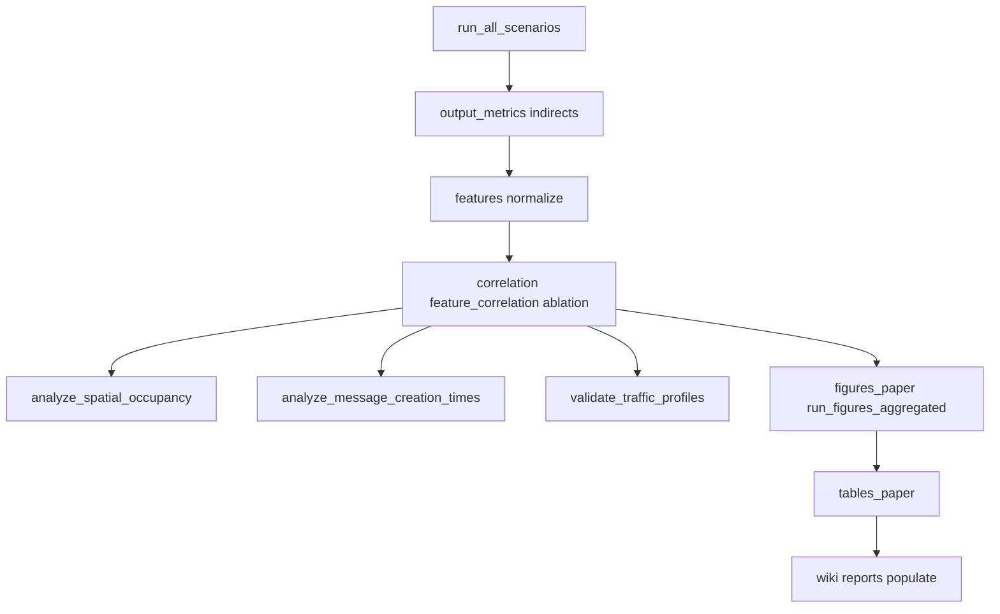

# Índice de scripts del pipeline (`scenarios/analysis/`)

**Corpus activo:** `corpus_v1` — **540** escenarios (540 ambientales + 30 stress/control). Incluye `` cuando se usa `--corpus corpus_v1`.  
**Capa estructural:** `base_scenarios/` — 45 escenarios sin TP (familias 01–06).  
**No existe `corpus_v3/`** — referencias a corpus_v3 son históricas; scripts v3 están en [`../_archive/scripts/`](../_archive/scripts/). El alias CLI `corpus_v2` está obsoleto.

**Documentación relacionada:** [INVENTARIO.md](../INVENTARIO.md) · [RESULTADOS_ACTUALES.md](reports/RESULTADOS_ACTUALES.md) · [README.md](README.md)

---

## Leyenda de categorías

| Categoría | Descripción |
|-----------|-------------|
| **CORE_PIPELINE** | Orquestación central o fases imprescindibles para reproducir resultados del paper |
| **SIMULATION_RUNNER** | Lanza simulaciones The ONE (`one.sh`) y genera reportes en `reports/` |
| **ANALYSIS** | Post-proceso de métricas, auditorías o CSV derivados |
| **FIGURES_TABLES** | Figuras o tablas para publicación / exploración agregada |
| **WIKI_DOCS** | Generación de wiki o informes metodológicos de documentación |
| **DASHBOARD** | Exploración visual interactiva (Streamlit) |
| **LEGACY** | Histórico; propuesta corpus_v3 o sustituido por revisión v2 in-place |
| **EXPERIMENTAL** | Útil en desarrollo pero no parte del freeze del paper |

**Estado:** `activo` (mantenimiento corriente) · `histórico` (one-off o archivado) · `experimental` (opcional / auxiliar)

---

## Scripts en raíz `analysis/` (núcleo)

| Script | Categoría | Entrada principal | Salida principal | Paper | Estado | Notas |
|--------|-----------|-------------------|------------------|-------|--------|-------|
| [run_analysis.py](run_analysis.py) | CORE_PIPELINE | `corpus_v1/*.settings`, `reports/` | `data/`, `figures/`, `reports/` | sí | activo | Fases: `features`, `normalize`, `correlation`, `ablation`, `figures`, `figures_paper`, `tables_paper`, `output_metrics`, `outputs`, `indirects` |
| [run_all_scenarios.py](run_all_scenarios.py) | SIMULATION_RUNNER | corpus + `one.sh` + overlays | `../../reports/*Report*` | sí | activo | Batch; filtros `--family`, `--tp`, `--settings` |
| [run_figures_aggregated.py](run_figures_aggregated.py) | FIGURES_TABLES | `manifest.csv`, CSVs correlación/outputs | `figures/aggregated/` | sí | activo | Por familia, TP, base×TP |
| [analysis_menu.py](analysis_menu.py) | EXPERIMENTAL | menú interactivo | delega subprocess | no | activo | [MENU.md](MENU.md); submenú Paper/validación 4a–4n, ruta paper-ready (10), protocolos por overlay (11) |
| [dashboard.py](dashboard.py) | DASHBOARD | CSVs, figuras, reports | UI Streamlit | no | activo | Entrada: `streamlit run dashboard.py` |

## Scripts secundarios (`scripts/`)

| Script | Categoría | Entrada principal | Salida principal | Paper | Menú |
|--------|-----------|-------------------|------------------|-------|------|
| [scripts/validation/validate_traffic_profiles.py](scripts/validation/validate_traffic_profiles.py) | ANALYSIS | `corpus_v1`, manifest | `tp_validation_*` | sí | 4a |
| [scripts/validation/validate_corpus_benchmark.py](scripts/validation/validate_corpus_benchmark.py) | ANALYSIS | manifest + CSVs | `corpus_benchmark_validation.*` | sí | 4c |
| [scripts/validation/audit_settings.py](scripts/validation/audit_settings.py) | ANALYSIS | corpus | `settings_audit.csv` | no | 4j |
| [scripts/validation/diagnose_scenarios.py](scripts/validation/diagnose_scenarios.py) | ANALYSIS | settings + métricas | `scenario_diagnosis.*` | no | 4k |
| [scripts/validation/compute_useful_simulation_time.py](scripts/validation/compute_useful_simulation_time.py) | ANALYSIS | ConnectivityONEReport | `useful_simulation_time_*` | no | 5 |
| [scripts/validation/analyze_message_creation_times.py](scripts/validation/analyze_message_creation_times.py) | ANALYSIS | `.settings` | `message_creation_time_*` | sí | 6 |
| [scripts/validation/analyze_spatial_occupancy.py](scripts/validation/analyze_spatial_occupancy.py) | ANALYSIS | `*_spatial_occupancy_grid.csv` | heatmaps, `spatial_*.csv` | sí | 7 |
| [scripts/paper/analyze_traffic_profile_kpis.py](scripts/paper/analyze_traffic_profile_kpis.py) | ANALYSIS | manifest + CSVs | `traffic_profile_*` | sí | 4d |
| [scripts/paper/build_protocol_benchmark_kpi_policy.py](scripts/paper/build_protocol_benchmark_kpi_policy.py) | ANALYSIS | manifest_revision, KPIs | policy MD/CSV | sí | 4e |
| [scripts/paper/build_message_analysis_window_policy.py](scripts/paper/build_message_analysis_window_policy.py) | ANALYSIS | manifest + message times | window policy | sí | 4f |
| [scripts/paper/analyze_spatial_vs_performance.py](scripts/paper/analyze_spatial_vs_performance.py) | ANALYSIS | spatial + output CSVs | `spatial_vs_performance_analysis.md` | sí | 4g |
| [scripts/paper/build_paper_figures_tables_index.py](scripts/paper/build_paper_figures_tables_index.py) | FIGURES_TABLES | figuras + data | índice paper, readiness | sí | 4h |
| [scripts/paper/build_paper_freeze_checklist.py](scripts/paper/build_paper_freeze_checklist.py) | ANALYSIS | manifest + reports | freeze checklist | sí | 4i |
| [scripts/paper/build_inventory_update_report.py](scripts/paper/build_inventory_update_report.py) | ANALYSIS | filesystem | `inventory_update_report.md` | no | 4n |
| [scripts/wiki/build_wiki_research_reports.py](scripts/wiki/build_wiki_research_reports.py) | WIKI_DOCS | CSVs, wiki | `reports/validation/` | parcial | 4m |
| [scripts/wiki/populate_wiki_paper.py](scripts/wiki/populate_wiki_paper.py) | WIKI_DOCS | plantillas | `.wiki-clone/` | sí | 4l |

### Eliminados (2026-05-24; ver `CHANGELOG.md`)

| Script | Motivo |
|--------|--------|
| `generate_corpus_v1_traffic.py` | Corpus_v2 ya generado; lógica TP en `lib/traffic_profile_generator.py` |
| `validate_reports_reorganization.py` | Auditoría one-off post-reorg reports |
| `apply_corpus_v1_revision.py`, `build_corpus_v1_revision_plan.py` | Revisión v2 ya aplicada |

### Fases de `run_analysis.py` (referencia rápida)

| Fase | Salidas típicas | Paper |
|------|-----------------|-------|
| `features` | `features.csv`, `scenario_list.txt` | sí |
| `features_report` | `features_report.md/.txt` | sí |
| `normalize` | `features_normalized.csv`, `features_core.csv`, `features_reduced.csv` | sí |
| `correlation` | `correlation_pearson*.csv`, `distance_*.csv`, `cluster_assignments*.csv` | sí |
| `feature_correlation` | `feature_feature_correlation_core.csv` | sí |
| `ablation` | `ablation_metrics.csv`, `ablation_report.txt` | sí |
| `figures` | histogramas, heatmaps (N×N solo con `--include-full-heatmaps`) | parcial |
| `figures_paper` | `figures/paper/main/`, `supplementary/` | sí |
| `figures_aggregated` | delega en `run_figures_aggregated.py` | sí |
| `tables_paper` | `figures/paper/tables/*.md` | sí |
| `indirects` | `indirect_features_diego.csv` | sí (Diego17) |
| `output_metrics` | `output_metrics.csv` | sí |
| `outputs` | correlaciones en espacio Y | sí |
| `all` | secuencia completa | — |

**Scope flags:** `` (default for diversity) → 540 `corpus_v1` scenarios; `` → 540 combined.

### Validación de diversidad — script → artefacto

| Script / fase | Artefactos generados |
|---------------|---------------------|
| `run_analysis.py --phase features ` | `data/features.csv`, `data/scenario_list.txt` |
| `--phase normalize` | `features_normalized.csv` (46), `features_core.csv` (23), `features_reduced.csv` (17), `normalization_params.csv` |
| `--phase correlation` | `correlation_pearson.csv`, `correlation_spearman.csv`, `distance_cosine.csv`, `distance_euclidean.csv`, `correlation_pearson_core23.csv`, `distance_cosine_core23.csv`, `cluster_assignments*.csv`, `reports/pipeline/correlation_*.txt`, `clustering_report.txt`, `scenarios_to_diversify*.txt` |
| `--phase feature_correlation` | `feature_feature_correlation_core.csv`, `figures/heatmap_feature_feature_core.png` |
| `--phase ablation` | `ablation_metrics.csv`, `reports/pipeline/ablation_report.txt` |
| `--phase figures` | `figures/by_space/*`, histogramas raíz |
| `--phase figures_paper` | `figures/paper/main/*.png`, `figures/paper/supplementary/*.png` |
| `--phase tables_paper` | `figures/paper/tables/table_*.md` |
| `scripts/paper/validate_diversity_readiness.py` | `reports/diversity_validation_readiness.md`, `data/diversity_validation_checklist.csv`, `data/diversity_figures_inventory.csv`, `reports/diversity_archive_candidates.md` |
| `scripts/paper/validate_final_artifact_consistency.py` | `data/final_artifact_consistency.csv`, `reports/project/final_artifact_consistency_report.md` |
| `scripts/paper/build_paper_figures_tables_index.py` | `figures/paper/FIGURES_AND_TABLES_INDEX.md`, `reports/paper_gate/paper_figures_tables_readiness.md` |

Informe canónico único: [reports/RESULTADOS_ACTUALES.md](reports/RESULTADOS_ACTUALES.md) (n=540).

---

## Bibliotecas (`lib/`)

Módulos de soporte importados por scripts; no se ejecutan directamente.

| Módulo | Categoría | Entrada principal | Salida principal | Paper | Estado | Notas |
|--------|-----------|-------------------|------------------|-------|--------|-------|
| [paths.py](lib/paths.py) | CORE_PIPELINE | — | constantes de ruta | sí | activo | `DATA_DIR`, `CORPUS_V1_DIR`, `overlays/` |
| [traffic_profile_generator.py](lib/traffic_profile_generator.py) | CORE_PIPELINE | — | TP01–TP12 canónicos | sí | activo | Sustituye generador histórico |
| [report_paths.py](lib/report_paths.py) | CORE_PIPELINE | — | rutas MD/CSV informes | sí | activo | Subcarpetas `reports/` |
| [settings_audit.py](lib/settings_audit.py) | ANALYSIS | `.settings` | estructuras parseadas | no | activo | Usado por `audit_settings.py` |
| [scenario_select.py](lib/scenario_select.py) | SIMULATION_RUNNER | corpus dir, filtros | lista de paths `.settings` | sí | activo | `run_all_scenarios.py` |
| [scenario_diagnosis.py](lib/scenario_diagnosis.py) | ANALYSIS | settings + métricas | flags diagnóstico | no | activo | `diagnose_scenarios.py` |
| [spatial_occupancy_io.py](lib/spatial_occupancy_io.py) | ANALYSIS | `reports/` paths | paths CSV espacial | sí | activo | `analyze_spatial_occupancy.py` |
| [connectivity_timeline.py](lib/connectivity_timeline.py) | ANALYSIS | ConnectivityONEReport | series temporales | no | experimental | `compute_useful_simulation_time.py` |
| [map_context.py](lib/map_context.py) | ANALYSIS | `.settings`, WKT | contexto mapa/underlay | sí | activo | Heatmaps espaciales |
| [__init__.py](lib/__init__.py) | CORE_PIPELINE | — | paquete | — | activo | |

---

## Dashboard (`dashboard/` + `dashboard.py`)

Exploración interactiva; no forma parte de la reproducibilidad batch del paper.

| Módulo | Categoría | Entrada principal | Salida principal | Paper | Estado | Notas |
|--------|-----------|-------------------|------------------|-------|--------|-------|
| [dashboard.py](dashboard.py) | DASHBOARD | — | invoca `dashboard.app` | no | activo | `streamlit run scenarios/analysis/dashboard.py` |
| [app.py](dashboard/app.py) | DASHBOARD | sesión Streamlit | navegación páginas | no | activo | Router principal |
| [components.py](dashboard/components.py) | DASHBOARD | widgets | UI reutilizable | no | activo | |
| [data_loaders.py](dashboard/data_loaders.py) | DASHBOARD | `data/*.csv`, manifest | DataFrames + filtros | no | activo | Joins paper-ready; `write_dashboard_readiness_report()` |
| [README.md](dashboard/README.md) | DASHBOARD | — | guía páginas/filtros | no | activo | |
| [pages/home.py](dashboard/pages/home.py) | DASHBOARD | métricas agregadas | resumen corpus | no | activo | 720 sims, pipeline |
| [pages/benchmark_kpis.py](dashboard/pages/benchmark_kpis.py) | DASHBOARD | `traffic_profile_kpi_summary.csv` | KPIs por TP | sí | activo | Paper TP comparison |
| [pages/message_window.py](dashboard/pages/message_window.py) | DASHBOARD | `message_analysis_window_policy.csv` | ventana mensajes | sí | activo | |
| [pages/useful_time.py](dashboard/pages/useful_time.py) | DASHBOARD | `useful_simulation_time_metrics.csv` | tiempo útil | sí | activo | |
| [pages/protocols.py](dashboard/pages/protocols.py) | DASHBOARD | placeholder | futuro multi-protocolo | no | activo | |
| [pages/scenario_explorer.py](dashboard/pages/scenario_explorer.py) | DASHBOARD | manifest, CSVs | tabla filtrable | no | activo | |
| [pages/scenario_detail.py](dashboard/pages/scenario_detail.py) | DASHBOARD | escenario seleccionado | detalle + figuras | no | activo | bench + policy |
| [pages/traffic_profiles.py](dashboard/pages/traffic_profiles.py) | DASHBOARD | `tp_validation_*` | perfiles TP | no | activo | |
| [pages/spatial.py](dashboard/pages/spatial.py) | DASHBOARD | spatial metrics | heatmaps enlazados | no | activo | |
| [pages/corpus_audit.py](dashboard/pages/corpus_audit.py) | DASHBOARD | diagnosis + bench validation | diagnóstico | no | activo | |
| [pages/figures_guide.py](dashboard/pages/figures_guide.py) | DASHBOARD | `figures/README.md` | guía figuras | no | activo | |
| [pages/analysis_pipeline.py](dashboard/pages/analysis_pipeline.py) | DASHBOARD | estado fases | pipeline UI | no | activo | |
| [pages/raw_reports.py](dashboard/pages/raw_reports.py) | DASHBOARD | `../../reports/` | visor reportes | no | activo | |
| [pages/__init__.py](dashboard/pages/__init__.py) | DASHBOARD | — | paquete páginas | no | activo | |
| [__init__.py](dashboard/__init__.py) | DASHBOARD | — | paquete | no | activo | |

---

## LEGACY — scripts archivados (`_archive/scripts/`)

| Script | Categoría | Entrada principal | Salida principal | Paper | Estado | Notas |
|--------|-----------|-------------------|------------------|-------|--------|-------|
| [recommend_corpus_v3.py](../_archive/scripts/recommend_corpus_v3.py) | LEGACY | diagnosis, audit | `corpus_v3_*` en `_archive/` | no | histórico | Propuesta v3 **no implementada**; no usar |
| [compare_corpus_versions.py](../_archive/scripts/compare_corpus_versions.py) | LEGACY | corpus_v1 vs v3 | diff esqueleto | no | histórico | `corpus_v3/` no existe en disco |

**Menciones históricas en documentación:**

- Scripts de revisión v2 (`build_corpus_v1_revision_plan.py`, `apply_corpus_v1_revision.py`) — eliminados; ver `CHANGELOG.md`
- `build_wiki_research_reports.py` — comentario: `map_realism_review.md` archivado en `_archive/reports/`

Ningún script activo importa ni invoca `recommend_corpus_v3.py`.

---

## Pipeline oficial para paper

Orden recomendado para reproducir resultados con **corpus_v1** (desde la raíz del repo ONE). Usar `venv/bin/python` o `python3` según entorno.



### 1. Simulación

```bash
python3 scenarios/analysis/run_all_scenarios.py --corpus corpus_v1 \
  --extra-settings scenarios/analysis/overlays/routing_contact_reports_overrides.txt \
  --extra-settings scenarios/analysis/overlays/spatial_occupancy_reports_overrides.txt \
  --jobs 4
```

Salida: `reports/*MessageStatsReport.txt`, `*_spatial_occupancy_grid.csv`, etc.

### 2. Extracción de outputs (routing + indirectos)

```bash
python3 scenarios/analysis/run_analysis.py --corpus corpus_v1 --phase output_metrics
python3 scenarios/analysis/run_analysis.py --corpus corpus_v1 --phase indirects
```

Salida: `data/output_metrics.csv`, `data/indirect_features_diego.csv`

### 3. Features

```bash
python3 scenarios/analysis/run_analysis.py --corpus corpus_v1 --phase features
python3 scenarios/analysis/run_analysis.py --corpus corpus_v1 --phase features_report
```

Salida: `data/features.csv`, `reports/pipeline/features_report.md`

### 4. Normalización

```bash
python3 scenarios/analysis/run_analysis.py --corpus corpus_v1 --phase normalize
```

Salida: `data/features_normalized.csv`, `features_core.csv`, `features_reduced.csv`

### 5. Correlaciones

```bash
python3 scenarios/analysis/run_analysis.py --corpus corpus_v1 --phase correlation
python3 scenarios/analysis/run_analysis.py --corpus corpus_v1 --phase feature_correlation
```

Salida: `data/correlation_pearson*.csv`, `reports/pipeline/correlation_report.txt`, `reports/pipeline/correlation_core23_report.txt`, `reports/pipeline/clustering_report.txt`, `reports/pipeline/scenarios_to_diversify*.txt`

### 6. Ablación (17 vs 23 vs 46 features)

```bash
python3 scenarios/analysis/run_analysis.py --corpus corpus_v1 --phase ablation
```

Salida: `data/ablation_metrics.csv`, `reports/pipeline/ablation_report.txt`

### 7. Ocupación espacial

```bash
cd scenarios/analysis
python3 scripts/validation/analyze_spatial_occupancy.py \
  --manifest ../corpus_v1/manifest.csv \
  --reports-dir reports \
  --corpus corpus_v1
```

Salida: `data/spatial_occupancy_metrics.csv`, `figures/spatial_heatmaps/*.png` (target 540 combined; legacy files may still show 720 rows)

### 8. Tiempos de creación de mensajes

```bash
python3 scenarios/analysis/scripts/validation/analyze_message_creation_times.py
```

Salida: `data/message_creation_time_summary.csv`, figuras en `figures/`

```bash
python3 scenarios/analysis/scripts/paper/build_message_analysis_window_policy.py
```

Salida: `data/message_analysis_window_policy.csv`, `data/message_analysis_window_by_tp.csv`, `reports/message_analysis_window_policy.md`

### 9. Validación de perfiles de tráfico

```bash
python3 scenarios/analysis/scripts/validation/validate_traffic_profiles.py
```

Salida: `data/tp_validation_*.csv`, `reports/tp_validation_report.md`

### 10. Figuras paper

```bash
python3 scenarios/analysis/run_analysis.py --corpus corpus_v1 --phase figures_paper
python3 scenarios/analysis/run_figures_aggregated.py --corpus corpus_v1
```

Salida: `figures/paper/`, `figures/aggregated/`

### 11. Tablas paper

```bash
python3 scenarios/analysis/run_analysis.py --corpus corpus_v1 --phase tables_paper
```

Salida: `figures/paper/tables/*.md` (ES/EN)

```bash
python3 scenarios/analysis/scripts/paper/build_paper_figures_tables_index.py
```

Salida: `figures/paper/FIGURES_AND_TABLES_INDEX.md`, `reports/paper_gate/paper_figures_tables_readiness.md`, figuras promovidas y `corpus_overview_paper`

```bash
python3 scenarios/analysis/scripts/paper/build_paper_freeze_checklist.py
```

Salida: `reports/paper_freeze_checklist.md`, `data/paper_freeze_checklist.csv`

### 12. Wiki (documentación paper)

```bash
python3 scenarios/analysis/scripts/wiki/build_wiki_research_reports.py
python3 scenarios/analysis/scripts/wiki/populate_wiki_paper.py
```

Salida: `scenarios/.wiki-clone/` (gitignored localmente)

---

### Pipeline canónico — validación de diversidad (540, sin stress)

```bash
python3 scenarios/analysis/run_analysis.py --corpus corpus_v1  \
  --phase features normalize correlation feature_correlation ablation figures_paper tables_paper
python3 scenarios/analysis/scripts/paper/validate_diversity_readiness.py
python3 scenarios/analysis/scripts/wiki/populate_wiki_paper.py
```

Métricas congeladas: [reports/RESULTADOS_ACTUALES.md](reports/RESULTADOS_ACTUALES.md). Metodología: [docs/features_core_vs_extended.md](docs/features_core_vs_extended.md).

### Atajo: pipeline completo de análisis (sin simulación ni espacial)

```bash
python3 scenarios/analysis/run_analysis.py --corpus corpus_v1 --phase all
```

No incluye simulación, `analyze_spatial_occupancy`, `analyze_message_creation_times`, ni wiki. Ejecutar esos pasos por separado según la tabla anterior.

---

## Scripts fuera del pipeline paper

| Script | Motivo |
|--------|--------|
| `scripts/validation/audit_settings.py`, `diagnose_scenarios.py` | Auditoría (menú 4j–4k) |
| `scripts/validation/compute_useful_simulation_time.py` | Métrica exploratoria (menú 5) |
| `analysis_menu.py` | Menú interactivo — [MENU.md](MENU.md) |
| `dashboard.py` + `dashboard/` | Exploración visual |
| `_archive/scripts/recommend_corpus_v3.py` | LEGACY — propuesta v3 abandonada |

---

## Referencia canónica de resultados

Tras el pipeline: [reports/RESULTADOS_ACTUALES.md](reports/RESULTADOS_ACTUALES.md)  
Mapa completo del repo: [../INVENTARIO.md](../INVENTARIO.md)