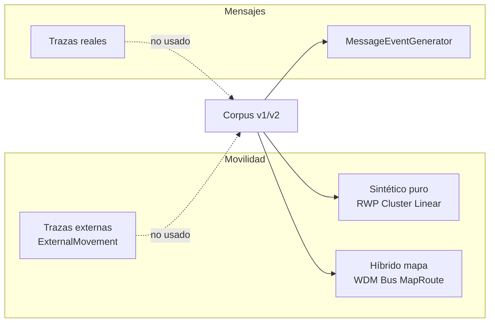

# Auditoría de realismo de trazas — corpus_v1 y corpus_v2

**Fecha:** 2026-05-19  
**Alcance:** 60 escenarios base (`corpus_v1`) + 720 variantes de tráfico (`corpus_v2` = 60 × 12 perfiles TP).  
**Método:** inspección estática de todos los `.settings` (sin ejecutar simulaciones ni modificar escenarios).  
**Fuentes:** `scenarios/corpus_v1/**/*.settings`, `scenarios/corpus_v2/**/*.settings`, `data/HelsinkiMedium/`, `generate_corpus_v2_traffic.py`.

---

## Conclusión ejecutiva

| Dimensión | Veredicto | Resumen |
|-----------|-----------|---------|
| **Movilidad** | **Híbrido** | 14/60 escenarios usan topología viaria real (dataset **HelsinkiMedium** del simulador ONE) con modelos estocásticos internos; 46/60 son totalmente sintéticos en espacio abstracto. **No hay** `ExternalMovement` ni `ExternalPathMovement` (replay de trazas GPS). |
| **Mensajes** | **Sintético** | 100 % generados por `MessageEventGenerator` con parámetros (`interval`, `size`, `hosts`, `tohosts`, `time`). **No hay** trazas reales de tráfico de aplicaciones. En `corpus_v2`, el bloque `Events*` se sustituye por perfiles TP01–TP12 (también sintéticos). |
| **Corpus_v2** | **Híbrido + sintético** | Movilidad idéntica al escenario base de v1 (verificado 720/720); mensajes 100 % sintéticos vía generador de perfiles. |

**En una frase para el paper:** el benchmark combina **movilidad simulada** (en parte **restringida por mapa urbano** derivado de Helsinki) con **carga de mensajes sintética parametrizada**, sin replay de trazas de contactos ni de tráfico observado en el mundo real.

---

## 1. Criterios de clasificación

### Movilidad

| Etiqueta | Criterio en este repositorio |
|--------|------------------------------|
| **Sintético** | Modelos internos del ONE (`RandomWaypoint`, `ClusterMovement`, `LinearMovement`) en un `worldSize` abstracto, sin `MapBasedMovement.mapFile`. |
| **Híbrido (mapa)** | `MapBasedMovement` + ficheros WKT (`data/HelsinkiMedium/roads.wkt`, rutas de bus, POI de hogares/oficinas) + modelos `WorkingDayMovement`, `BusMovement` o `MapRouteMovement`. La **geometría de red** proviene del dataset estándar del ONE; las **trayectorias nodales** las genera el simulador (no son GPS grabados). |
| **Real (traza externa)** | `ExternalMovement` / `ExternalPathMovement` con ficheros de posiciones pregrabadas. **Ausente** en todo el corpus. |

### Mensajes

| Etiqueta | Criterio |
|--------|----------|
| **Sintético** | `MessageEventGenerator`: tasas, tamaños y pares origen–destino definidos en settings (distribuciones uniformes / rangos). |
| **Real** | Replay desde trazas de mensajes reales (p. ej. logs DTN, SMS, WhatsApp). **Ausente**. |
| **Excepción D8** | `ExternalEventsQueue` en `D8_*` inyecta eventos **CONN** (enlaces forzados a mitad de simulación), no mensajes de datos reales. |

---

## 2. Resumen por familia

| Familia | N | Movilidad | Mensajes (v1) | Notas |
|---------|--:|-----------|---------------|-------|
| 01 Urban | 7 | Híbrido (mapa) 7/7 | Sintético | `WorkingDayMovement` + `BusMovement` sobre HelsinkiMedium |
| 02 Campus | 6 | Sintético 6/6 | Sintético | `RandomWaypoint` (5) + `LinearMovement` (C6 evacuación) |
| 03 Vehicles | 5 | Híbrido (mapa) 5/5 | Sintético | Taxis `MapRouteMovement`; buses / WDM en Helsinki |
| 04 Rural | 12 | Sintético 11/12; híbrido 1/12 | Sintético | R4 usa mapa; resto RWP / clusters abstractos |
| 05 Disaster | 9 | Sintético 8/9; híbrido 1/9 | Sintético (+ eventos CONN en D8) | D5 mapa; D8 `ExternalEventsQueue` |
| 06 Social | 6 | Sintético 6/6 | Sintético | Clusters y RWP en mundo abstracto |
| 07 Traffic | 15 | Sintético 15/15 | Sintético | Familia de sensibilidad de tráfico/recursos |

---

## 3. Tabla por modelo de movilidad

| Modelo | Escenarios base (n) | Asignaciones a grupos* | Presente en corpus | Naturaleza |
|--------|--------------------:|-----------------------:|:------------------:|------------|
| **RandomWaypoint** | 41 | 41 | Sí | Sintético — espacio libre |
| **WorkingDayMovement** | 9 | 9 | Sí | Híbrido — mapa Helsinki + rutinas estocásticas (casa–trabajo–ocio) |
| **BusMovement** | 10 | 10 | Sí | Híbrido — ruta WKT sobre mapa |
| **ClusterMovement** | 6 | 6 | Sí | Sintético — hotspots `clusterCenter` / `clusterRange` |
| **MapRouteMovement** | 4 | 4 | Sí | Híbrido — sigue ruta WKT (taxi, mulas, patrulla) |
| **LinearMovement** | 1 | 1 | Sí | Sintético — trayectoria recta parametrizada (C6) |
| **ShortestPathMapBasedMovement** | 0 | 0 | **No** | — |
| **ExternalMovement** | 0 | 0 | **No** | — |
| **ExternalPathMovement** | 0 | 0 | **No** | — |

\*Un escenario con varios grupos cuenta varias asignaciones (p. ej. U1: 1× `BusMovement` + 1× `WorkingDayMovement`).

### Dataset HelsinkiMedium (14 escenarios)

Ficheros en `data/HelsinkiMedium/`:

- `roads.wkt` — red viaria (coordenadas UTM zona Helsinki, dataset estándar del ONE).
- `A_bus.wkt`, `B_bus.wkt`, … — rutas de transporte simplificadas.
- `A_homes.wkt`, `A_offices.wkt`, `A_meetingspots.wkt`, … — puntos de interés para WDM.

**Interpretación:** topología y anclas espaciales **inspiradas en entorno urbano real**; comportamiento temporal y elección de destinos **generados por el modelo**, no por trazas de usuarios reales.

Escenarios que referencian HelsinkiMedium:  
`U1–U7`, `V1–V5`, `R4`, `D5`.

---

## 4. Tabla por escenario base (corpus_v1)

| Familia | Escenario | Modelo(s) de movilidad | Movilidad | Mensajes | Events.nrof |
|---------|-----------|------------------------|-----------|----------|-------------|
| 01 Urban | `U1_CBD_Commuting_HelsinkiMedium` | BusMovement, WorkingDayMovement | híbrido (mapa) | sintético | 1 |
| 01 Urban | `U2_SparseSuburb_HelsinkiMedium` | BusMovement, WorkingDayMovement | híbrido (mapa) | sintético | 1 |
| 01 Urban | `U3_MicroMobility_HelsinkiMedium` | BusMovement, WorkingDayMovement | híbrido (mapa) | sintético | 1 |
| 01 Urban | `U4_CongestionHotspot_HelsinkiMedium` | BusMovement, WorkingDayMovement | híbrido (mapa) | sintético | 2 |
| 01 Urban | `U5_WorkdayShort_HelsinkiMedium` | BusMovement, WorkingDayMovement | híbrido (mapa) | sintético | 1 |
| 01 Urban | `U6_OfficeWaitHeavyTail_HelsinkiMedium` | BusMovement, WorkingDayMovement | híbrido (mapa) | sintético | 2 |
| 01 Urban | `U7_HighTimeVariance_HelsinkiMedium` | BusMovement, WorkingDayMovement | híbrido (mapa) | sintético | 2 |
| 02 Campus | `C1_Campus_ClassChange` | RandomWaypoint | sintético | sintético | 1 |
| 02 Campus | `C2_ExamDay_LongStays` | RandomWaypoint | sintético | sintético | 1 |
| 02 Campus | `C3_Hackathon_24h` | RandomWaypoint | sintético | sintético | 2 |
| 02 Campus | `C4_Stadium_IngressEgress` | RandomWaypoint | sintético | sintético | 2 |
| 02 Campus | `C5_Library_Quiet` | RandomWaypoint | sintético | sintético | 1 |
| 02 Campus | `C6_EmergencyDrill_Evacuation` | LinearMovement | sintético | sintético | 1 |
| 03 Vehicles | `V1_TaxiLow_HelsinkiMedium` | MapRouteMovement | híbrido (mapa) | sintético | 1 |
| 03 Vehicles | `V2_TaxiHigh_HelsinkiMedium` | MapRouteMovement | híbrido (mapa) | sintético | 1 |
| 03 Vehicles | `V3_BusOnlyCarriers_HelsinkiMedium` | BusMovement | híbrido (mapa) | sintético | 2 |
| 03 Vehicles | `V4_CarOwnership_0_HelsinkiMedium` | BusMovement, WorkingDayMovement | híbrido (mapa) | sintético | 2 |
| 03 Vehicles | `V5_CarOwnership_100_HelsinkiMedium` | BusMovement, WorkingDayMovement | híbrido (mapa) | sintético | 1 |
| 04 Rural | `R10_TinyRange_5m` | RandomWaypoint | sintético | sintético | 1 |
| 04 Rural | `R11_SpeedExtremeLow` | RandomWaypoint | sintético | sintético | 1 |
| 04 Rural | `R12_SpeedExtremeHigh` | RandomWaypoint | sintético | sintético | 1 |
| 04 Rural | `R1_Rural_RandomWaypoint` | RandomWaypoint | sintético | sintético | 1 |
| 04 Rural | `R2_VillagesTrails_ThreeClusters` | ClusterMovement | sintético | sintético | 1 |
| 04 Rural | `R3_WildlifeTracking` | RandomWaypoint | sintético | sintético | 1 |
| 04 Rural | `R4_ParkRangers_HelsinkiMedium` | MapRouteMovement | híbrido (mapa) | sintético | 1 |
| 04 Rural | `R5_MountainRescue` | RandomWaypoint | sintético | sintético | 1 |
| 04 Rural | `R6_SparseLongRange` | RandomWaypoint | sintético | sintético | 1 |
| 04 Rural | `R7_SparseTinyBuffer` | RandomWaypoint | sintético | sintético | 1 |
| 04 Rural | `R8_IntermittentPower` | RandomWaypoint | sintético | sintético | 1 |
| 04 Rural | `R9_ExtremeRange_200m` | RandomWaypoint | sintético | sintético | 1 |
| 05 Disaster | `D1_ShelterHotspots_Clusters` | ClusterMovement, RandomWaypoint | sintético | sintético | 1 |
| 05 Disaster | `D2_PartitionedCity_MuleBridge` | ClusterMovement, RandomWaypoint | sintético | sintético | 1 |
| 05 Disaster | `D3_Aftershock_ErraticMobility` | RandomWaypoint | sintético | sintético | 1 |
| 05 Disaster | `D4_MedicalTriage_TwoClasses` | RandomWaypoint | sintético | sintético | 2 |
| 05 Disaster | `D5_UAVMule_FastRoute_HelsinkiMedium` | MapRouteMovement | híbrido (mapa) | sintético | 1 |
| 05 Disaster | `D6_ShortTtlCritical_5to10min` | RandomWaypoint | sintético | sintético | 1 |
| 05 Disaster | `D7_HighLoad_TrafficStorm` | RandomWaypoint | sintético | sintético | 1 |
| 05 Disaster | `D8_InfrastructureReturns_BackboneLinks` | ClusterMovement | sintético | sintético + cola eventos | 2 |
| 05 Disaster | `D9_Critical_1minTTL` | RandomWaypoint | sintético | sintético | 1 |
| 06 Social | `S1_StrongCommunities_SeparateClusters` | ClusterMovement | sintético | sintético | 1 |
| 06 Social | `S2_WeakCommunities_HighMixing` | RandomWaypoint | sintético | sintético | 1 |
| 06 Social | `S3_PeriodicMeetings_RegularRhythm` | RandomWaypoint | sintético | sintético | 1 |
| 06 Social | `S4_RandomMixing_NoHotspots` | RandomWaypoint | sintético | sintético | 1 |
| 06 Social | `S5_TwoLayer_StudentsStaff` | RandomWaypoint | sintético | sintético | 1 |
| 06 Social | `S6_FamilyGroups_SmallPersistent` | ClusterMovement | sintético | sintético | 1 |
| 07 Traffic | `T10_HighRateLowSpeed_Congestion` | RandomWaypoint | sintético | sintético | 1 |
| 07 Traffic | `T11_TTL_1min` | RandomWaypoint | sintético | sintético | 1 |
| 07 Traffic | `T12_TTL_Infinite_Buffer200M` | RandomWaypoint | sintético | sintético | 2 |
| 07 Traffic | `T13_Buffer_256k` | RandomWaypoint | sintético | sintético | 1 |
| 07 Traffic | `T14_Buffer_200M` | RandomWaypoint | sintético | sintético | 2 |
| 07 Traffic | `T15_TransmitSpeed_256k` | RandomWaypoint | sintético | sintético | 1 |
| 07 Traffic | `T1_ManySmallMsgs_HighRate` | RandomWaypoint | sintético | sintético | 1 |
| 07 Traffic | `T2_FewHugeMsgs_LowRate` | RandomWaypoint | sintético | sintético | 1 |
| 07 Traffic | `T3_MixedBimodal_SmallAndLarge` | RandomWaypoint | sintético | sintético | 2 |
| 07 Traffic | `T4_VeryShortTtl_5to10min` | RandomWaypoint | sintético | sintético | 1 |
| 07 Traffic | `T5_VeryLongTtl_6to24h` | RandomWaypoint | sintético | sintético | 1 |
| 07 Traffic | `T6_UniformSources_RandomFromTo` | RandomWaypoint | sintético | sintético | 1 |
| 07 Traffic | `T7_TargetedToHubs_FewDestinations` | RandomWaypoint | sintético | sintético | 1 |
| 07 Traffic | `T8_BurstTraffic_TimeWindows` | RandomWaypoint | sintético | sintético | 2 |
| 07 Traffic | `T9_BufferStress_SmallBufferHighTraffic` | RandomWaypoint | sintético | sintético | 1 |

---

## 5. Generación de mensajes (detalle)

### Mecanismo universal

Todos los escenarios usan **`MessageEventGenerator`** (`Events1.class`, y opcionalmente `Events2`).

Parámetros observados en `corpus_v1`:

| Parámetro | Uso | Realismo |
|-----------|-----|----------|
| `Events.nrof` | 1 o 2 generadores | Configuración |
| `Events*.interval` | Rango min–max (s) entre mensajes | Sintético |
| `Events*.size` | Rango de payload (`10k`, `1M`, …) | Sintético |
| `Events*.hosts` | Rango de índices de emisores | Sintético |
| `Events*.tohosts` | Destinos restringidos (hubs, triage, staff) en ~10 escenarios | Sintético dirigido |
| `Events*.time` | Ventana temporal de generación en 9 escenarios | Sintético (burst / fases) |
| `Events*.prefix` | Prefijo de ID (`M`, `N`) | Sintético |

**Escenarios con `Events*.time` (ventana de generación):**  
`C3`, `C4`, `T8`, `T12`, `T14`, `U4`, `U6`, `U7`, `V4`.

**Escenarios con `Events*.tohosts`:**  
`S5`, `T7`, `T12`, `T13`, `T14`, `V3`, `V4`, `U4`, `U6`, `U7`, `D4`.

### Excepción: D8 (no es tráfico real)

`D8_InfrastructureReturns_BackboneLinks`:

- `Events1` → `MessageEventGenerator` (tráfico normal).
- `Events2` → `ExternalEventsQueue` → `D8_backbone_events.txt` (eventos `CONN host up` en *t* = 21600 s).

Esto **simula** retorno de infraestructura; **no** importa trazas de mensajes medidas.

### corpus_v2 (720 escenarios)

- **Movilidad:** idéntica al `.settings` base de v1 en los 720 casos (mismos `Group*.movementModel`).
- **Mensajes:** bloque `Events*` **reemplazado** por `generate_corpus_v2_traffic.py` (perfiles **TP01–TP12**).
- Todos usan `MessageEventGenerator`; **708/720** solo MessageEventGenerator; **12/720** (variantes `D8__TP*`) conservan además `ExternalEventsQueue` del base.
- **No** se encontraron trazas externas de mensajes en `corpus_v2`.

---

## 6. Explicación para paper / tesis

### Qué afirmar con precisión

1. **El corpus es un benchmark de simulación**, no una reproducción empírica de un despliegue DTN concreto.
2. **La movilidad** se produce con modelos del simulador The ONE. Una fracción (23,3 % de escenarios base) usa el mapa **HelsinkiMedium** (red viaria y rutas WKT del distribuible estándar del ONE), lo que introduce **realismo geométrico** pero **no** trazas de posición de dispositivos reales.
3. **El tráfico de mensajes** es **enteramente sintético**, definido por tasas, tamaños y patrones origen–destino. En `corpus_v2`, doce perfiles de tráfico (TP01–TP12) barren regímenes de carga, TTL y direccionalidad de forma controlada.
4. **No se utilizan** `ExternalMovement` ni replay de contactos/mensajes de campañas de medición (DieselNet, Haggle, etc.).

### Qué no afirmar

- No decir que las trazas son “reales” o “medidas en campo”.
- No mezclar “mapa de Helsinki” con “trazas GPS de usuarios”.
- No presentar `MessageEventGenerator` como tráfico de aplicación capturado.

### Diagrama conceptual

---

## 7. Limitaciones metodológicas

1. **Sin validación contra trazas empíricas:** no hay calibración estadística (distribuciones de contacto, inter-contact time, payload) respecto a datasets públicos.
2. **HelsinkiMedium es un escenario canónico del ONE**, no un mapa actualizado ni demografía local específica del estudio.
3. **Modelos sintéticos simplifican** correlaciones temporales y sociales presentes en datos reales (amistad, horarios, preferencias).
4. **MessageEventGenerator** asume generación con intervalos y tamaños independientes; no modela sesiones de aplicación ni contenido.
5. **Familia 07_traffic** duplica muchos ejes ya cubiertos por TP01–TP12 en v2; en v1 su tráfico sigue siendo sintético con distintos parámetros.
6. **D8** altera conectividad por eventos scriptados; es un artefacto de modelado, no observación.
7. **Esta auditoría es estática** (settings); no verifica si ficheros WKT externos faltan en tiempo de ejecución.

---

## 8. Redacción recomendada (español)

### Párrafo corto (metodología)

> Empleamos el simulador The ONE con un corpus de 60 escenarios de movilidad y 720 variantes de carga de mensajes. La movilidad se genera mediante modelos sintéticos del simulador (`RandomWaypoint`, `ClusterMovement`, `WorkingDayMovement`, `BusMovement`, `MapRouteMovement`, `LinearMovement`). En 14 escenarios la movilidad está restringida por la topología viaria del dataset estándar **HelsinkiMedium** (coordenadas y red del área metropolitana de Helsinki incluida en el distribuible del ONE), pero las trayectorias nodales son **simuladas**, no replay de GPS. El tráfico de datos se modela con **`MessageEventGenerator`**: intervalos, tamaños y patrones de comunicación definidos paramétricamente; en `corpus_v2`, doce perfiles de tráfico (TP01–TP12) sustituyen la configuración de eventos del escenario base. **No** utilizamos trazas externas de movilidad (`ExternalMovement`) ni de mensajes reales.

### Una línea (pie de figura / tabla)

> Movilidad: simulada (híbrida con mapa Helsinki en 23 % de escenarios base); mensajes: sintéticos (`MessageEventGenerator`).

### Inglés (opcional)

> Mobility is simulated using The ONE's built-in models; 14/60 base scenarios constrain movement to the HelsinkiMedium road map (standard ONE dataset), without GPS trace replay. Message traffic is fully synthetic via `MessageEventGenerator` and twelve parameterized traffic profiles (TP01–TP12) in corpus_v2. No external mobility or message traces are used.

---

## 9. corpus_v2 — nota de consistencia

| Aspecto | Resultado de la auditoría |
|---------|---------------------------|
| Movilidad vs v1 | **0 discrepancias** en `Group*.movementModel` (720/720) |
| Mensajes | **100 %** `MessageEventGenerator` en el bloque TP; D8 mantiene `ExternalEventsQueue` adicional |
| Conclusión v2 | Misma clasificación de movilidad que el base; mensajes **homogéneamente sintéticos** según TP |

---

## 10. Referencias internas

- Guía de modelos: `scenarios/README.es.md` §6–7  
- Perfiles TP: `scenarios/internal/16-traffic_profiles_v1_justification.md`  
- Cierre metodológico benchmark: `scenarios/internal/17-benchmark_methodology_closure.md`  
- Generador v2: `scenarios/analysis/generate_corpus_v2_traffic.py`
