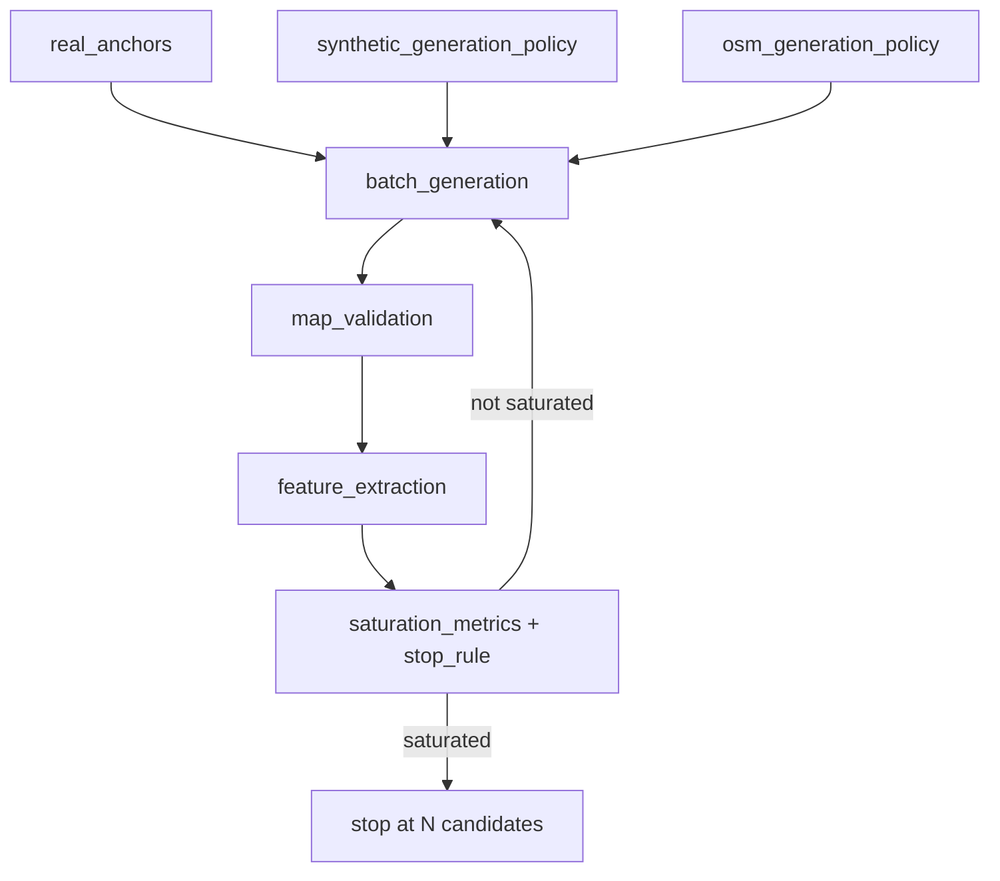

# Map design space with saturation — methodology v1

**Status:** specification only (no maps generated in this phase)  
**Config:** `scenarios/analysis/config/map_design_space_saturation_v1.yaml`  
**Archetype table:** `scenarios/analysis/data/map_archetype_definitions_v1.csv`

---

## 1. Why we abandon manual selection of six maps

The legacy corpus used six hand-picked WKT maps (`HelsinkiDowntown`, `KumpulaCampus`, `KallioCommunityCompact`, `ManhattanMidtownGrid`, `NuuksioSparseTrails`, `HelsinkiDisrupted`). That approach was adequate for early scenario reproduction but is **not defensible** as a claim about map-topology coverage:

- Selection was **intuitive**, not tied to a declared design space.
- Pool size was **fixed** (six), not derived from measurable saturation.
- Trace-only datasets (INFOCOM, Haggle contacts) were **not** represented as topology references.
- OSM variants around anchors were **not** systematically explored (window sizes, offsets).
- Synthetic topologies were **under-specified** relative to literature anchors.

Phase 2 replaces intuition with a **declared design space**, **batch generation**, **feature extraction**, and a **saturation stop rule**. The final number of maps **N** is an outcome of the procedure, not a preset.

---

## 2. Role of real anchors and why synthetics complement them

### Real anchors (OSM and trace references)

Real anchors ground the design space in literature and datasets already used in DTN / mobility research:

| Anchor family | Examples | Role |
|---------------|----------|------|
| Helsinki tradition | downtown, Kumpula, Kallio | Urban/campus/social baselines in The ONE |
| US vehicular | Manhattan, SF downtown, SF corridor | Grid and irregular vehicular mobility |
| Bus / suburban | DieselNet Amherst | Bus-route and suburban topology |
| Pedestrian / social | Cambridge Haggle, MIT Reality | Social and campus pedestrian anchors |
| Rural / trails | Nuuksio, Lapland | Sparse trail and rural road networks |
| Industrial / disrupted | Helsinki Kalasatama, London industrial | Partitioned and disaster-oriented topology |

OSM anchors (`osm_bbox`, `osm_place`) yield **downloadable** road networks with documented provenance. Trace references (`trace_reference_not_map`) **do not** produce direct maps; they parameterize synthetic generators.

### Synthetic generators

Synthetics fill gaps OSM cannot cover systematically:

- **Controlled variation** of gridness, radiality, corridor aspect, community structure.
- **Trace-inspired** compact event venues (INFOCOM) without pretending a venue map exists.
- **Stress topologies** (disrupted grid, partitioned bridges) with known removal rates.
- **Reproducibility** via `stable_seed` (SHA-256), independent of Overpass availability.

The design space is therefore **real-anchor-informed + synthetic-complemented**, not “random OSM worldwide.”

---

## 3. Why INFOCOM / Info5 is not a direct map

INFOCOM 2005 (Info5) and related conference traces record **contact events** between devices in a venue. They do **not** ship a reliable, georeferenced road graph suitable for The ONE map-based movement.

In this specification:

- `infocom_event_compact` and `infocom_2006_trace` use `anchor_type: trace_reference_not_map`.
- Expected topology (small diameter, high community score) is encoded as **synthetic parameters** for `conference_event_compact`.
- Claims must refer to **“INFOCOM-inspired compact event topology”**, not “the INFOCOM map.”

The same principle applies to `rollernet_trace` and `haggle_contacts_only`: traces inform **archetype and generator parameters**; geographic maps come from separate OSM anchors where applicable (e.g. `cambridge_haggle`).

---

## 4. Batch generation flow

Each batch:

1. **Sample** OSM variants (exact bbox + controlled offsets; window sizes 500–5000 m) and synthetic variants (13 generators).
2. **Validate** maps (topology, connectivity, asset policy).
3. **Extract** normalized feature vectors (see YAML `feature_space`).
4. **Compute** saturation metrics (cluster count, nearest-representative distances, archetype coverage, batch-over-batch improvement).
5. **Apply** stop rule or continue with next batch size from `[100, 200, 400, 600, 800, 1000]`.

Default evaluation points for **N** are `[400, 600, 800]`; the actual stop occurs when the rule fires, not at a fixed index.

---

## 5. Operational definition of saturation

**Saturation** means: additional batches add **negligible new structure** in the declared normalized feature space.

Concretely, after at least **two batches** and **200 valid maps**, generation may stop when **two consecutive batches** satisfy **all** of:

| Condition | Threshold |
|-----------|-----------|
| New clusters | Relative gain in `n_clusters` **< 5%** vs previous batch |
| Max distance reduction | Relative reduction in `max_nearest_selected_distance` **< 5%** |
| Archetype coverage | Set of covered archetypes **unchanged** |
| Invalid maps | Failures do **not** open new valid feature-space regions |

When stopped, the defensible statement is:

> *Map generation stopped at N candidates because coverage of the declared map-topology feature space reached saturation under the defined metrics and stop rule.*

---

## 6. “Coverage of the declared representable space in The ONE”

**Completeness** is defined **only** with respect to:

- The **archetypes** listed in `map_archetype_definitions_v1.csv`.
- The **real anchors** and **13 synthetic generators** in the YAML.
- The **feature vector** in `feature_space` (topology metrics + `source_type`, `anchor_id`, `archetype`).

It is **not** completeness of:

- All cities, terrains, or infrastructure on Earth.
- All OSM extractable regions.
- All contact-trace datasets in the literature.

Representability in The ONE further requires: WKT road graphs, map-based or route-based movement compatibility, and validation under `map_asset_policy_v1.yaml`. Maps that fail validation do not count toward saturation unless they demonstrably expand the valid feature hull (the stop rule assumes they do not).

---

## 7. Allowed and forbidden claims

### Allowed

- Explicit **map-topology design space** with documented anchors and generators.
- **Real-trace-inspired** and **OSM-based** map anchors with provenance.
- **Synthetic topology generators** with reproducible seeds.
- **Feature-space diversity** and **saturation-based** stop criterion.
- **Scenario generation** over maps selected from a saturated pool.

### Forbidden

- “All possible situations on Earth.”
- “All possible real-world maps.”
- “Complete representation of reality.”
- “Mathematically complete Earth coverage.”
- Treating INFOCOM/Info5 or other contact traces as **direct downloadable maps**.

---

## 8. Artefacts in this phase

| Artefact | Path |
|----------|------|
| Design space + policies | `scenarios/analysis/config/map_design_space_saturation_v1.yaml` |
| Methodology (this document) | `scenarios/analysis/reports/map_design_space_saturation_v1.md` |
| Archetype definitions | `scenarios/analysis/data/map_archetype_definitions_v1.csv` |

**No map files are generated until the batch pipeline is executed in a later phase.**

---

## 9. Relation to prior work

- **Anchors source:** `real_map_anchors_v1.yaml` (normalized into saturation spec).
- **Legacy six maps:** frozen in `scenarios/maps/wkt/` for corpus reproduction only.
- **Phase 1 cleanup:** `map_generation_cleanup_phase1.md`; generators archived under `_legacy/map_space_v1_phase1/`.
- **Next implementation step:** batch runner wired to this YAML, reusing `map_space_topology.py` and validation/feature scripts from legacy phase where applicable.
