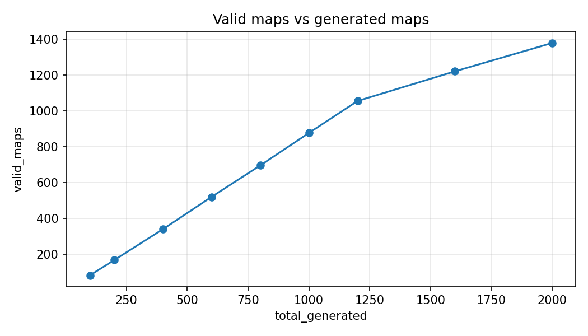
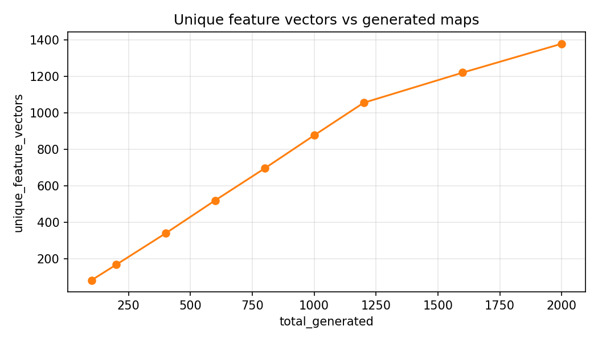
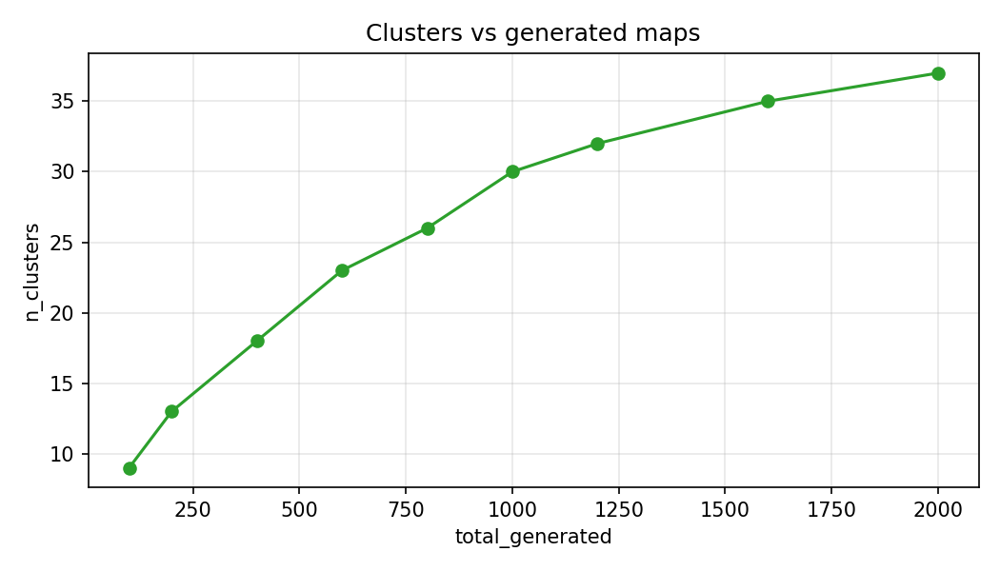
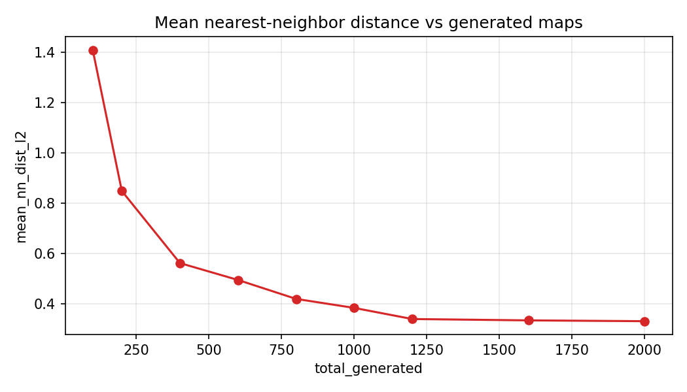
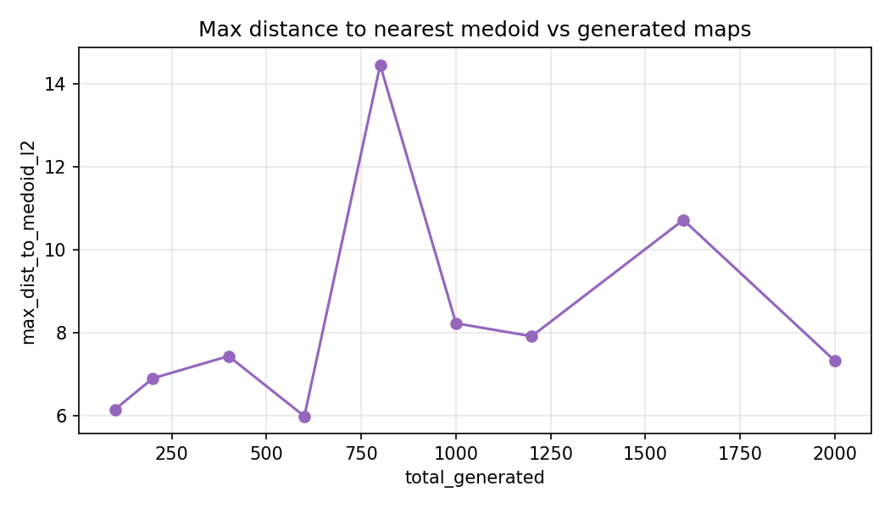
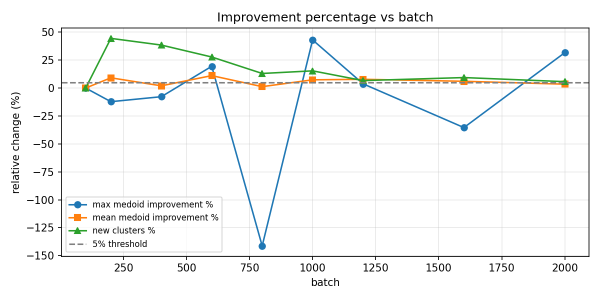
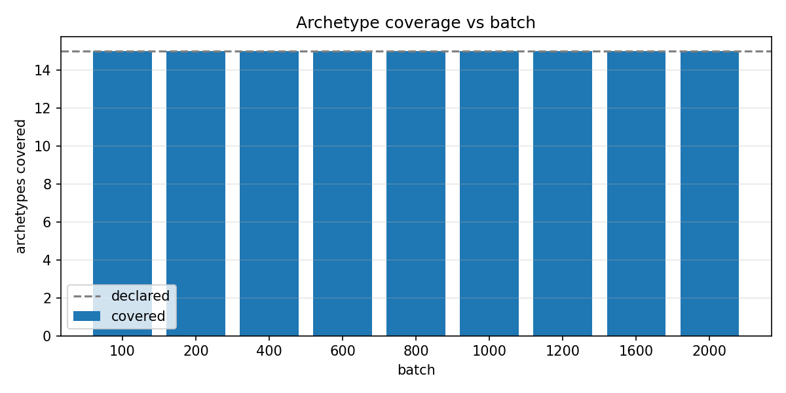
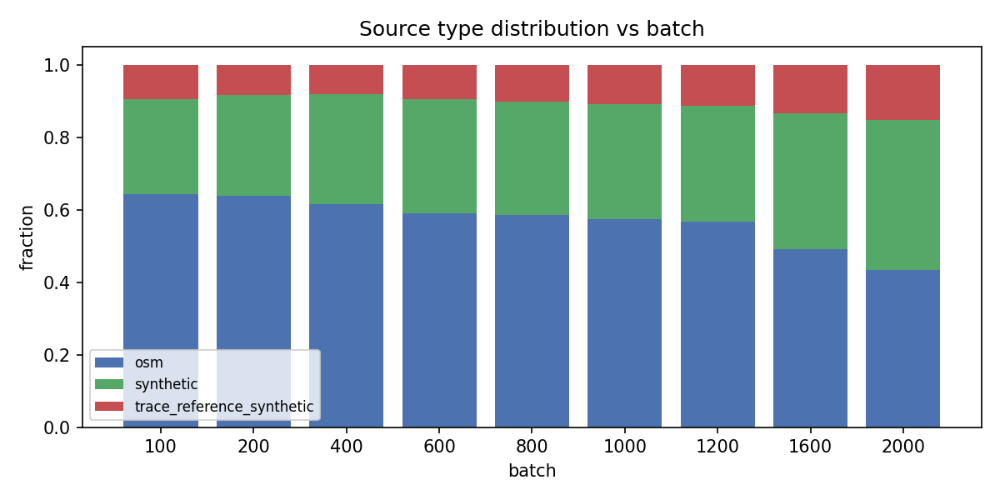

# Map space saturation analysis (v1)

Generated: 2026-06-22 09:22 UTC

## Executive summary

**Decision:** `stop_at_1200_confirmed_by_2000`

**Recommended stop batch:** 1200

**Stop rule mode:** `robustness_extension_confirmation`

**Max batch evaluated:** 2000 (2000 generated, 1378 valid, 622 invalid)

Robustness extension to batch 2000 confirmed saturation at the methodological point batch 1200: two consecutive post-1200 transitions met extension criteria (15/15 archetypes, marginal valid growth <30% of previous valid pool, mean medoid improvement <8%, new clusters <16%, >=50% redundant/invalid new maps). Recommended methodological stop remains batch 1200 (1055 valid at 1200); full run reached 2000 generated / 1378 valid / 622 invalid (+323 valid after 1200).

**Paper-ready claim:**

> Map generation methodological stop remains at N=1200 candidates (1055 validation-passing maps at batch 1200, 15/15 declared archetypes covered). A robustness extension to N=2000 candidates added 323 further valid maps while post-1200 tranches showed >=50% redundant or invalid new maps, confirming that the 1200 stopping decision was not premature. Completeness is defined with respect to this declared design space, not all possible real-world environments.

## Metrics by cumulative batch

| batch | total_generated | valid_maps | invalid_maps | unique_feature_vectors | valid_archetypes_covered | valid_anchors_covered | archetype_coverage_frac | source_type_osm | source_type_synthetic | source_type_trace_reference_synthetic | source_type_osm_frac | source_type_synthetic_frac | source_type_trace_reference_synthetic_frac | n_clusters | n_clusters_hier | n_clusters_fps | mean_nn_dist_l2 | median_nn_dist_l2 | max_nn_dist_l2 | mean_dist_to_medoid_l2 | max_dist_to_medoid_l2 | mean_dist_to_medoid_cosine | max_dist_to_medoid_cosine | mean_dist_to_medoid_fps_l2 | max_dist_to_medoid_fps_l2 | pca_var_explained_2 | pca_var_explained_5 | pca_var_explained_10 | new_maps_since_prev |
| --- | --- | --- | --- | --- | --- | --- | --- | --- | --- | --- | --- | --- | --- | --- | --- | --- | --- | --- | --- | --- | --- | --- | --- | --- | --- | --- | --- | --- | --- |
| 100.0 | 100.0 | 84.0 | 16.0 | 84.0 | 15.0 | 18.0 | 1.0 | 54.0 | 22.0 | 8.0 | 0.6428571428571429 | 0.2619047619047619 | 0.09523809523809523 | 9.0 | 9.0 | 9.0 | 1.4083123229836554 | 0.8745573659771366 | 15.68773796018151 | 2.059482511221374 | 6.153803385363777 | 0.18087617229311073 | 0.6396516627096513 | 3.4130588009136043 | 5.8457418859585255 | 0.5352008569465042 | 0.8056233864442537 | 0.9558170606832516 | 84.0 |
| 200.0 | 200.0 | 169.0 | 31.0 | 169.0 | 15.0 | 18.0 | 1.0 | 108.0 | 47.0 | 14.0 | 0.6390532544378699 | 0.2781065088757396 | 0.08284023668639054 | 13.0 | 13.0 | 13.0 | 0.848456015164084 | 0.5144724242185053 | 13.950737786298808 | 1.8709993664458755 | 6.904807275095792 | 0.1475971357506929 | 0.6115949669342126 | 3.0168805864125887 | 5.444842850997519 | 0.5357631499261816 | 0.8057624197224488 | 0.9484059994202353 | 85.0 |
| 400.0 | 400.0 | 341.0 | 59.0 | 341.0 | 15.0 | 18.0 | 1.0 | 210.0 | 103.0 | 28.0 | 0.6158357771260997 | 0.3020527859237537 | 0.08211143695014662 | 18.0 | 18.0 | 18.0 | 0.5619107922491403 | 0.35120270864217473 | 5.232563201817613 | 1.8338169094135768 | 7.439895692604429 | 0.11369186968889791 | 0.6106107092827762 | 2.6722534931950466 | 4.688001951259191 | 0.5335989429334237 | 0.7919215990598287 | 0.9438536307275136 | 172.0 |
| 600.0 | 600.0 | 521.0 | 79.0 | 521.0 | 15.0 | 19.0 | 1.0 | 307.0 | 164.0 | 50.0 | 0.5892514395393474 | 0.31477927063339733 | 0.09596928982725528 | 23.0 | 23.0 | 23.0 | 0.4947048722511479 | 0.29128070215731194 | 10.266744305036344 | 1.6299950036651687 | 5.991061650335272 | 0.10378933771863537 | 0.6065035689760206 | 2.5213969528518065 | 4.699757081809944 | 0.5215228792844028 | 0.7751212642153664 | 0.9336588411140893 | 180.0 |
| 800.0 | 800.0 | 696.0 | 104.0 | 696.0 | 15.0 | 19.0 | 1.0 | 407.0 | 218.0 | 71.0 | 0.5847701149425287 | 0.3132183908045977 | 0.10201149425287356 | 26.0 | 26.0 | 26.0 | 0.4195032467279541 | 0.24714279922553764 | 8.910132358636469 | 1.6096511645199794 | 14.454238424129862 | 0.08996914610717038 | 0.3701661869313937 | 2.4563906913010194 | 4.683490003557782 | 0.5150898445636797 | 0.77476639776004 | 0.9344614288068936 | 175.0 |
| 1000.0 | 1000.0 | 877.0 | 123.0 | 877.0 | 15.0 | 19.0 | 1.0 | 504.0 | 278.0 | 95.0 | 0.5746864310148233 | 0.3169897377423033 | 0.10832383124287344 | 30.0 | 30.0 | 30.0 | 0.38370247689558956 | 0.2076167045219488 | 8.230106174673924 | 1.491176536096844 | 8.230106174673924 | 0.09392238305081345 | 0.5901556891044002 | 2.2565188482484024 | 4.399119576697205 | 0.5100171880141776 | 0.7704066376974396 | 0.9322612552339115 | 181.0 |
| 1200.0 | 1200.0 | 1055.0 | 145.0 | 1055.0 | 15.0 | 19.0 | 1.0 | 599.0 | 337.0 | 119.0 | 0.5677725118483412 | 0.3194312796208531 | 0.11279620853080569 | 32.0 | 32.0 | 32.0 | 0.3395140677625642 | 0.17525276594208905 | 7.770456543477734 | 1.374566173610515 | 7.918724122079473 | 0.06600365800524008 | 0.4175845623301264 | 2.320889459236354 | 4.269054740696511 | 0.5057769621132292 | 0.76711491526687 | 0.9325053789281972 | 178.0 |
| 1600.0 | 1600.0 | 1220.0 | 380.0 | 1220.0 | 15.0 | 19.0 | 1.0 | 599.0 | 457.0 | 164.0 | 0.49098360655737705 | 0.37459016393442623 | 0.13442622950819672 | 35.0 | 35.0 | 35.0 | 0.33414289710932554 | 0.1886226400558459 | 7.6939196845449365 | 1.2913972065503603 | 10.72025315555281 | 0.06430790417056854 | 0.50387238240283 | 2.42211245653339 | 4.4332880542018644 | 0.49824961411267327 | 0.760146176240137 | 0.9337024459024369 | 165.0 |
| 2000.0 | 2000.0 | 1378.0 | 622.0 | 1378.0 | 15.0 | 19.0 | 1.0 | 599.0 | 570.0 | 209.0 | 0.4346879535558781 | 0.41364296081277213 | 0.1516690856313498 | 37.0 | 37.0 | 37.0 | 0.33088277492602053 | 0.2008401132509653 | 11.77696731295159 | 1.2466197405825157 | 7.324943726133947 | 0.055252080565474704 | 0.5027844428370447 | 2.3731659495360597 | 4.088159835145012 | 0.48720048095872526 | 0.7531252907401915 | 0.9351252044843779 | 158.0 |

## Batch transitions (stop-rule evaluation)

| prev_batch | batch | prev_total_generated | total_generated | prev_valid_maps | valid_maps | new_maps_since_prev | new_generated_since_prev | new_unique_vectors | near_redundant_new_fraction | redundant_new_fraction | invalid_new_fraction | rel_new_clusters | rel_improvement_max_medoid_l2 | rel_improvement_mean_medoid_l2 | archetype_set_changed | new_archetypes | new_source_types | n_clusters | prev_n_clusters | max_dist_to_medoid_l2 | prev_max_dist_to_medoid_l2 | eligible | all_pass | stop_rule_rel_new_clusters_pass | stop_rule_rel_improvement_max_medoid_l2_pass | stop_rule_rel_improvement_mean_medoid_l2_pass | stop_rule_archetype_set_unchanged_pass | stop_rule_no_new_archetypes_pass | stop_rule_no_new_source_types_pass | stop_rule_majority_redundant_or_invalid_pass | extension_eligible | extension_all_pass | rel_marginal_valid_frac |
| --- | --- | --- | --- | --- | --- | --- | --- | --- | --- | --- | --- | --- | --- | --- | --- | --- | --- | --- | --- | --- | --- | --- | --- | --- | --- | --- | --- | --- | --- | --- | --- | --- | --- |
| 100 | 200 | 100 | 200 | 84 | 169 | 85 | 100 | 85 | 0.21176470588235294 | 0.21176470588235294 | 0.15 | 0.4444444444444444 | -0.12203898023752346 | 0.09151966270581191 | False | [] | [] | 13 | 9 | 6.904807275095792 | 6.153803385363777 | False | False | False | False | False | True | True | True | False | False | False | 1.0119047619047619 |
| 200 | 400 | 200 | 400 | 169 | 341 | 172 | 200 | 172 | 0.2616279069767442 | 0.2616279069767442 | 0.14 | 0.38461538461538464 | -0.0774950547046533 | 0.019873046297674595 | False | [] | [] | 18 | 13 | 7.439895692604429 | 6.904807275095792 | True | False | False | False | True | True | True | True | False | False | False | 1.017751479289941 |
| 400 | 600 | 400 | 600 | 341 | 521 | 180 | 200 | 180 | 0.4111111111111111 | 0.4111111111111111 | 0.1 | 0.2777777777777778 | 0.19473848856635975 | 0.11114626803915056 | False | [] | [] | 23 | 18 | 5.991061650335272 | 7.439895692604429 | True | False | False | False | False | True | True | True | True | False | False | 0.5278592375366569 |
| 600 | 800 | 600 | 800 | 521 | 696 | 175 | 200 | 175 | 0.44 | 0.44 | 0.125 | 0.13043478260869565 | -1.412633898254239 | 0.012480921168129138 | False | [] | [] | 26 | 23 | 14.454238424129862 | 5.991061650335272 | True | False | False | False | True | True | True | True | True | False | False | 0.33589251439539347 |
| 800 | 1000 | 800 | 1000 | 696 | 877 | 181 | 200 | 181 | 0.49171270718232046 | 0.49171270718232046 | 0.095 | 0.15384615384615385 | 0.4306094909203511 | 0.07360267307262569 | False | [] | [] | 30 | 26 | 8.230106174673924 | 14.454238424129862 | True | False | False | False | False | True | True | True | True | True | True | 0.2600574712643678 |
| 1000 | 1200 | 1000 | 1200 | 877 | 1055 | 178 | 200 | 178 | 0.5224719101123596 | 0.5224719101123596 | 0.11 | 0.06666666666666667 | 0.037834512214757476 | 0.0782002396520782 | False | [] | [] | 32 | 30 | 7.918724122079473 | 8.230106174673924 | True | False | False | True | False | True | True | True | True | True | True | 0.20296465222348917 |
| 1200 | 1600 | 1200 | 1600 | 1055 | 1220 | 165 | 400 | 165 | 0.13333333333333333 | 0.13333333333333333 | 0.5875 | 0.09375 | -0.3537854066240218 | 0.06050561162995764 | False | [] | [] | 35 | 32 | 10.72025315555281 | 7.918724122079473 | True | False | False | False | False | True | True | True | True | True | True | 0.15639810426540285 |
| 1600 | 2000 | 1600 | 2000 | 1220 | 1378 | 158 | 400 | 158 | 0.1518987341772152 | 0.1518987341772152 | 0.605 | 0.05714285714285714 | 0.3167191464746503 | 0.03467365868589435 | False | [] | [] | 37 | 35 | 7.324943726133947 | 10.72025315555281 | True | False | False | False | True | True | True | True | True | True | True | 0.12950819672131147 |

## Metric definitions

- **total_generated**: validation records with `batch_target <= B`.
- **valid_maps**: maps with validation status PASS/WARNING/STRESS and extracted features.
- **unique_feature_vectors**: exact deduplication on cumulative z-scored features (tol=1e-06).
- **n_clusters**: non-empty clusters from k-medoids assignment (`k ≈ sqrt(n)`, capped at 50).
- **mean/median/max_nn_dist_l2**: nearest-neighbor distance in cumulative normalized L2 space.
- **mean/max_dist_to_medoid_l2**: distance to nearest k-medoid representative (L2).
- **mean/max_dist_to_medoid_cosine**: same with cosine distance on L2-normalized vectors.
- **pca_var_explained_K**: cumulative variance explained by first K PCA components (SVD).
- **rel_improvement_*_medoid_l2**: relative reduction in medoid coverage distance vs previous batch.
- **rel_new_clusters**: relative increase in cluster count vs previous batch.
- **redundant_new_fraction**: max(exact duplicate rate, near-duplicate rate vs previous cumulative set at NN threshold 0.25).
- **near_redundant_new_fraction**: new valid maps with L2 distance below 0.25 to any map in the previous cumulative batch.
- **invalid_new_fraction**: share of newly generated maps that failed validation.

**Extension confirmation** (post-batch 800): uses relative marginal valid growth `<30%` of previous valid pool (not absolute count), new clusters `<16%`, mean medoid improvement `<8%`, plus stable archetypes and >=50% redundant/invalid new maps across two consecutive extension transitions.

**Normalization:** z-score per numeric feature computed only on maps with `batch_target <= B` (no lookahead). `source_type` one-hot encoded within the same cumulative subset.

**Distances:** both Euclidean (L2) and cosine reported; stop rule uses L2 medoid coverage.

## Figures

## Recommended decision

| Field | Value |
|-------|-------|
| decision | `stop_at_1200_confirmed_by_2000` |
| recommended_stop_batch | 1200 |
| total_generated at stop | 1200 |
| valid_maps at stop | 1055 |

## Limitations

- Only 2000 candidates in the latest run (extend with batches 1000/1200 as needed).
- Declared archetypes not yet covered in valid maps: none.
- 15 archetypes declared; saturation is over the declared topology feature space only.
- Cluster count depends on k-medoids initialization (seed=42); hierarchical and farthest-point metrics provided as sensitivity.
- No sklearn; PCA via numpy SVD on cumulative normalized matrix.
- Global normalized CSV (`map_space_saturation_features_normalized.csv`) not used for primary metrics (cumulative normalization avoids lookahead).
